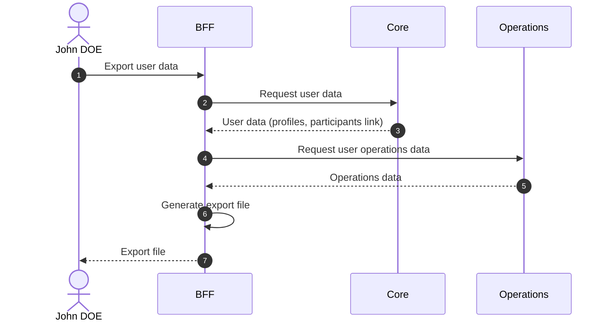

# Export User Data

## Objects used

- [User](/functional/business-objects/core/user)

## Allowed roles

- `PROJECT_ADMIN`
- `PROJECT_MANAGER`
- Any user for themselves

## Constraints

- Must not include other participants' personal data
- Must not include other users' personal data

Refer to [data policy](/functional/features/data-policy) for the expected format and exported data.

## Workflow

