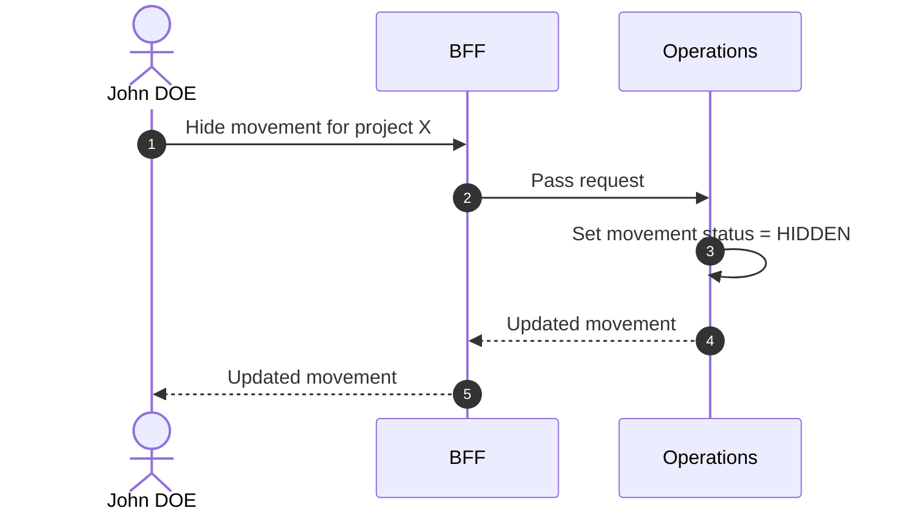

# Hide Movement

## Objects used

- [Movement](/functional/business-objects/operations/movement)

## Allowed roles

- `PROJECT_ADMIN`
- `PROJECT_MANAGER`
- `PROJECT_USER`

## Constraints

- `PROJECT_ADMIN`s and `PROJECT_MANAGER`s still see the movement, but it is marked `HIDDEN`.

## Workflow

::: info
Access to the project scope is automatically gated by the [authentication profile check](/functional/features/authentication#project-scope-access-check).
:::

