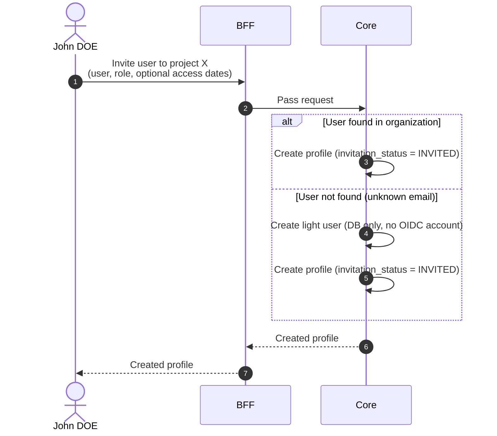

# Invite User to Project

## Objects used

- [Profile](/functional/business-objects/core/profile)
- [User](/functional/business-objects/core/user)

## Allowed roles

- `PROJECT_ADMIN`

## Constraints

- User is required (searched within organization scope)
- Project is required
- Type is automatically set to `DEFAULT`
- Role is required (you can only assign your own role or lower)
- Invitation status is automatically set to `INVITED`
- Access dates are optional

::: info Unknown user
If the user is not found in the organization (they have never logged in), the system automatically creates a [light user](/functional/business-objects/core/user#light-user-creation) in the database only — no OIDC account is created. Upon the user's first login, the application links their OIDC identity to any pending invitations.
:::

::: warning Light user purge
Light users that have not been linked to a real OIDC account within 6 months are automatically purged, along with their pending invitations.
:::

## Workflow

::: info
Access to the project scope is automatically gated by the [authentication profile check](/functional/features/authentication#project-scope-access-check).
:::

The inviter first searches for the target user via the [Search Users autocomplete](/functional/features/search-users#autocomplete).

