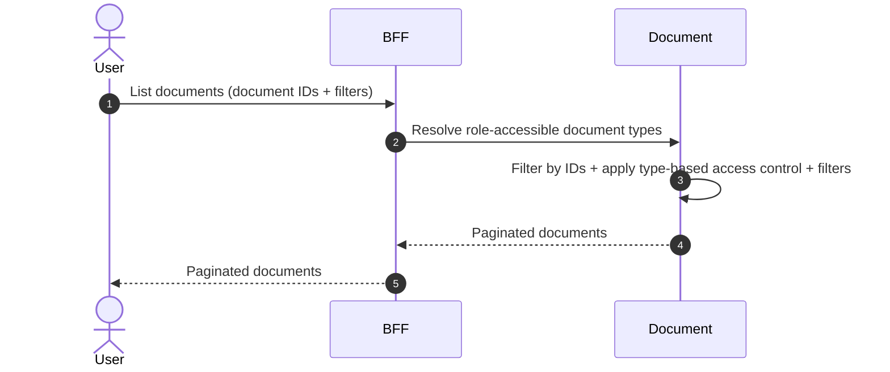

# List Documents

## Objects used

- [Document](/functional/business-objects/document/)

## Allowed roles

Permissions depend on the document type. The document type configuration defines which roles are authorized to list documents of that type. Documents of types the requesting user is not allowed to see are excluded from the results.

## Description

Returns document metadata for a given list of document IDs. The document module has no knowledge of who owns those IDs — the calling module provides the IDs it has stored in its own record and receives the corresponding documents back.

::: info No entity scope in the document module
There is no "list documents of participant X" endpoint in the document module. The calling module must supply the document IDs it already holds. Scoping by entity is the caller's responsibility.
:::

### Pagination

Results are paginated. Refer to [pagination](/functional/features/pagination) for details.

### Filters

#### Document type

| Property            | Value           |
|---------------------|-----------------|
| Type                | array (of enum) |
| Strictness          | strict          |
| Required            | no              |
| Eligible for search | `type`          |

#### Status

| Property            | Value           |
|---------------------|-----------------|
| Type                | array (of enum) |
| Strictness          | strict          |
| Required            | no              |
| Eligible for search | `status`        |

::: info Default status filter
By default, only `CLEAN` documents are returned. Pass an explicit `status` filter to include `PENDING`, `INFECTED`, or `REJECTED` documents (requires elevated role).
:::

#### Text search

| Property            | Value       |
|---------------------|-------------|
| Type                | text        |
| Strictness          | non-strict  |
| Required            | no          |
| Eligible for search | `name`      |

## Workflow

::: info
Access to the project or organization scope is automatically gated by the [authentication profile check](/functional/features/authentication#project-scope-access-check).
:::

