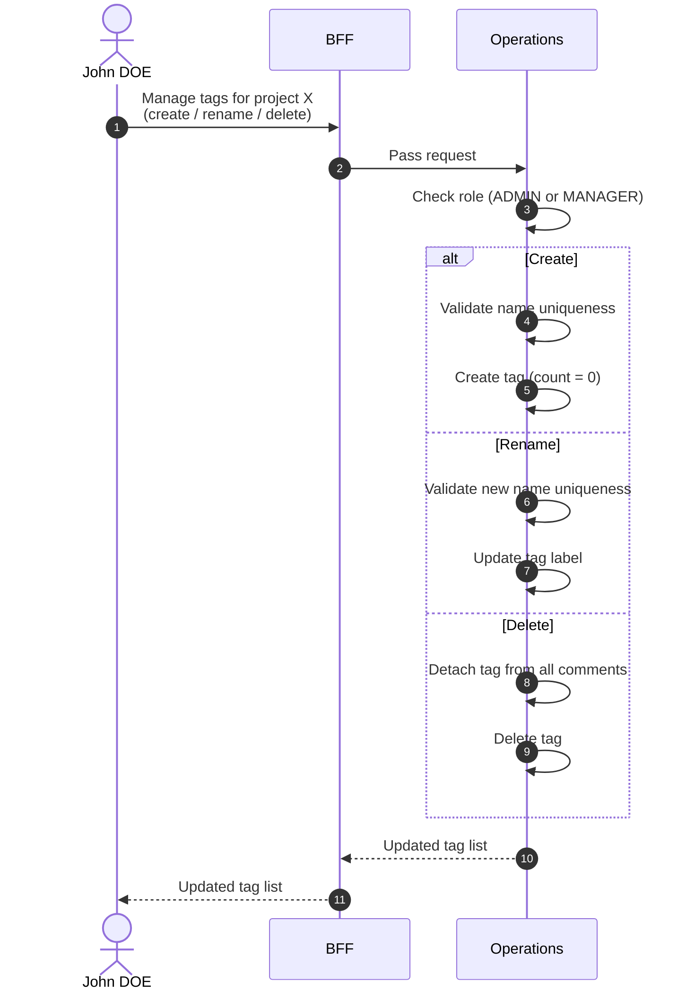

# Manage Tags

::: info Option required
Requires the **COMMENT** option to be enabled on the project.
:::

Project-scoped tags are managed from a dedicated project screen. This feature covers the creation, renaming, and deletion of tags in both catalogs:

- [Tag (Operations)](/functional/business-objects/operations/tag) — used by [participant comments](/functional/business-objects/operations/comment).
- [Tag (Preparation)](/functional/business-objects/preparation/tag) — used by [preparation comments](/functional/business-objects/preparation/comment).

The two catalogs are independent: creating a tag in Operations does not create it in Preparation, and vice-versa. The workflow, constraints, and roles described below apply identically to both.

## Objects used

- [Tag (Operations)](/functional/business-objects/operations/tag)
- [Tag (Preparation)](/functional/business-objects/preparation/tag)

## Allowed roles

- `PROJECT_ADMIN`
- `PROJECT_MANAGER`

Other roles can **use** tags on their comments (create/edit comments with existing tags) but cannot create, rename, or delete tags.

## Constraints

### Create tag

- Tag name is required and must be unique within the project (case-insensitive).
- Initial comment count is `0`.

### Rename tag

- New name must be unique within the project.
- Existing comments keep their association (the tag is the same entity; only its label changes).

### Delete tag

- Deleting a tag detaches it from every comment that carries it.
- The action is irreversible.
- If the tag still has a non-zero comment count, a confirmation is required.

## Workflow

::: info
Access to the project scope is automatically gated by the [authentication profile check](/functional/features/authentication#project-scope-access-check).
:::

