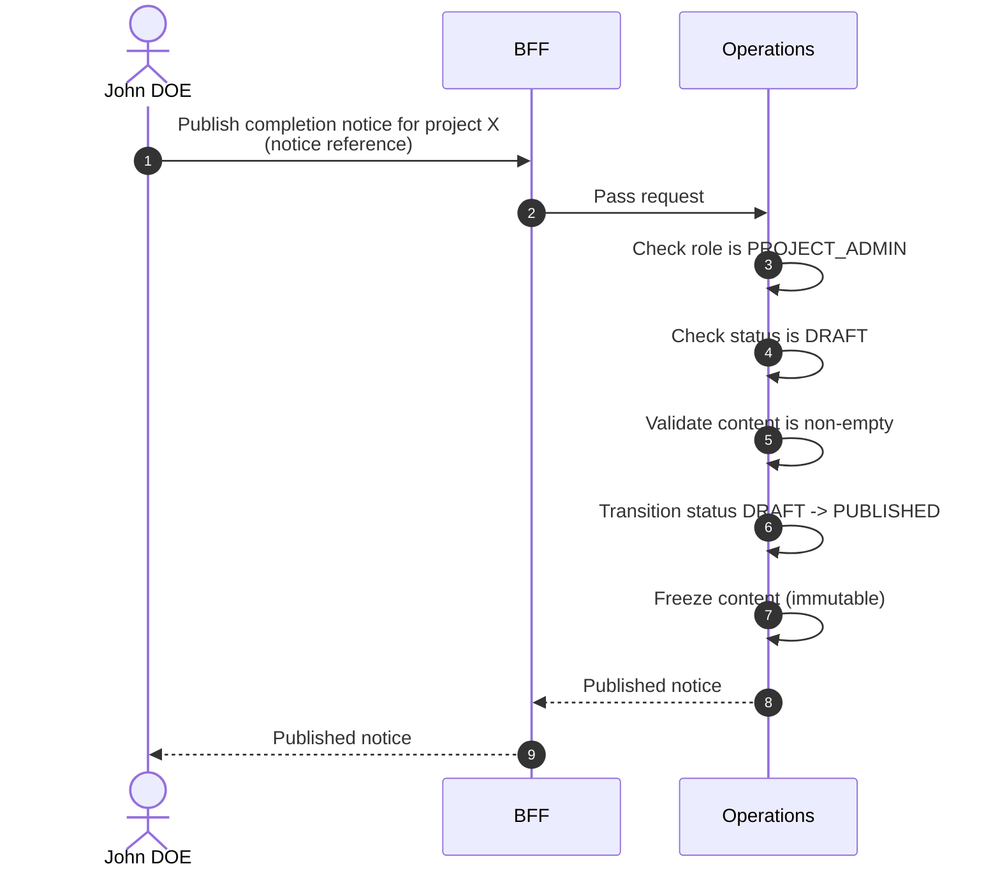

# Publish Completion Notice

::: info Option required
Requires the **COMPLETION_NOTICE** option to be enabled on the project.
:::

::: warning Irreversible
Publishing a notice transitions it from `DRAFT` to `PUBLISHED`. The transition is **irreversible**: a published notice cannot be reverted to `DRAFT`, and its content is frozen from that point on.
:::

## Objects used

- [Completion Notice](/functional/business-objects/operations/completion-notice)

## Allowed roles

- `PROJECT_ADMIN`

## Constraints

- Target notice must be in `DRAFT` status.
- `content` must be non-empty.
- After publication:
  - The notice is distributed to its recipients (internal stakeholders for `INTERNAL`, external recipients for `EXTERNAL`).
  - The notice becomes immutable.

## Workflow

::: info
Access to the project scope is automatically gated by the [authentication profile check](/functional/features/authentication#project-scope-access-check).
:::

