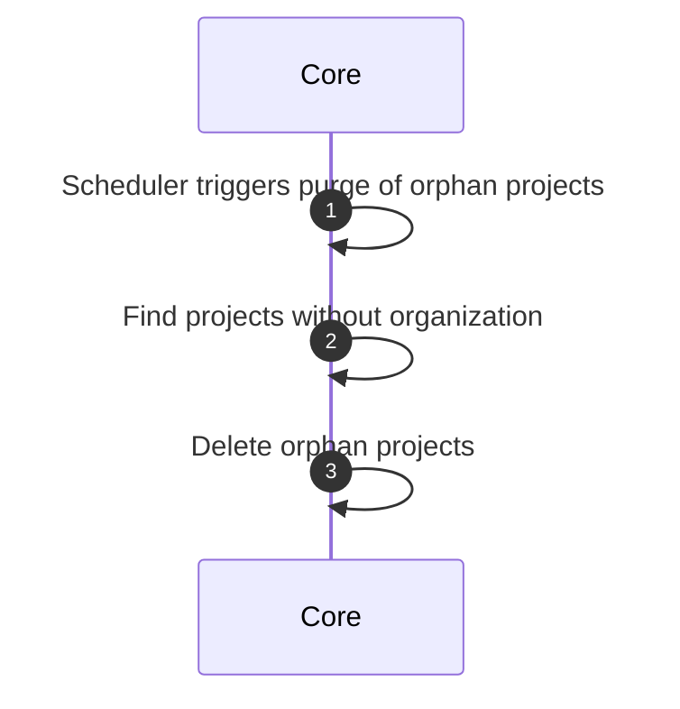
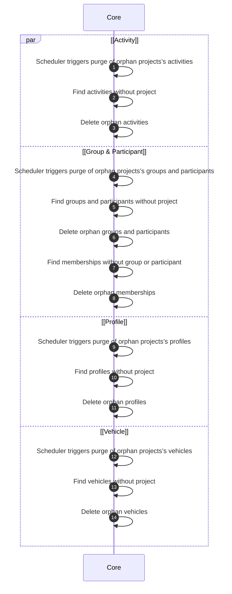

# Purge Orphans

## Allowed roles

- `SUPER_ADMIN`

## Trigger

- Scheduler triggers purge of orphans for all projects on a regular basis (e.g., daily).
- Manual trigger by a user with the appropriate role through the BFF.

## Organization’s orphans

### Objects used

- [Project](/functional/business-objects/core/project)

### Purge condition

All project without a defined organization (previously deleted).

### Constraints

- The deletion cannot be rolled back

### Workflow

## Project’s orphans

### Objects used

- [Activity](/functional/business-objects/core/activity)
- [Group](/functional/business-objects/core/group)
- [Participant](/functional/business-objects/core/participant)
- [Profile](/functional/business-objects/core/profile)
- [Vehicle](/functional/business-objects/core/vehicle)

### Purge condition

All object without a defined project (previously deleted).

### Constraints

- The deletion cannot be rolled back

### Workflow

