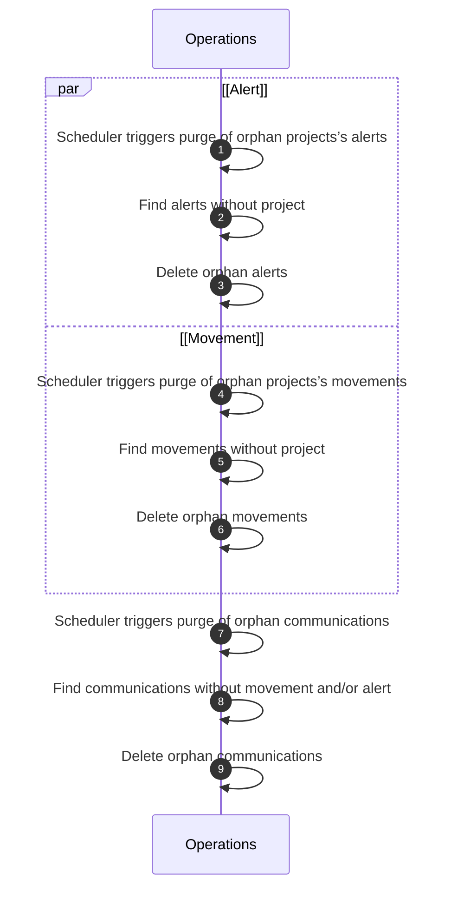

# Purge Orphans

## Allowed roles

- `SUPER_ADMIN`

## Trigger

- Scheduler triggers purge of orphans for all projects on a regular basis (e.g., daily).
- Manual trigger by a user with the appropriate role through the BFF.

## Objects used

- [Alert](/functional/business-objects/operations/alert)
- [Communication](/functional/business-objects/operations/communication)
- [Movement](/functional/business-objects/operations/movement)

## Purge condition

All object without a defined project (previously deleted).

## Constraints

- The deletion cannot be rolled back

## Workflow

