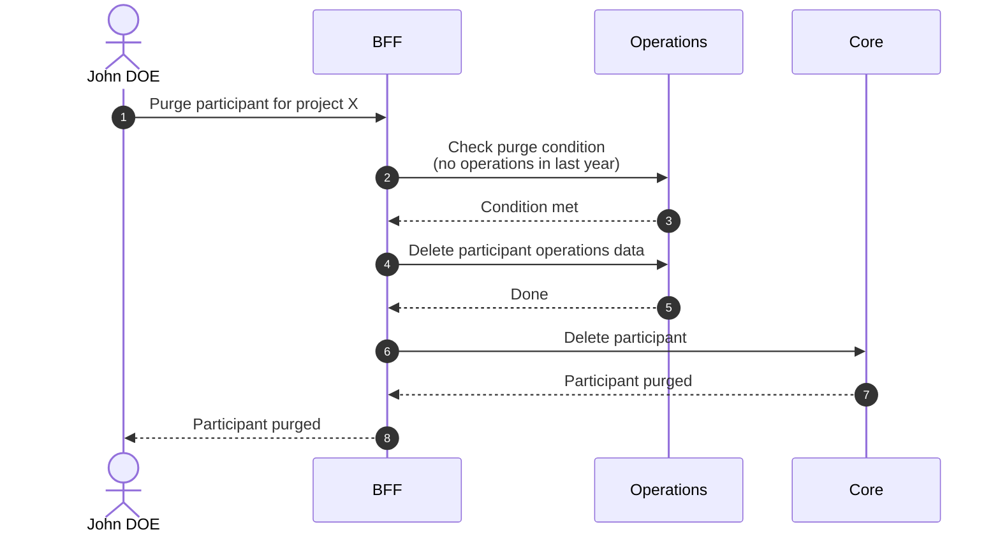

# Purge Participant

::: warning Irreversible
Purge is a permanent removal. It cannot be rolled back.
:::

## Objects used

- [Participant](/functional/business-objects/core/participant)

## Allowed roles

- `PROJECT_ADMIN`
- Any user linked to the concerned participant

## Purge condition

The participant must have had no related operation in the last year.

## Constraints

- The deletion MUST cascade to the [operations](/functional/business-objects/operations) module.
- The deletion cannot be rolled back

## Workflow

::: info
Access to the project scope is automatically gated by the [authentication profile check](/functional/features/authentication#project-scope-access-check).
:::

