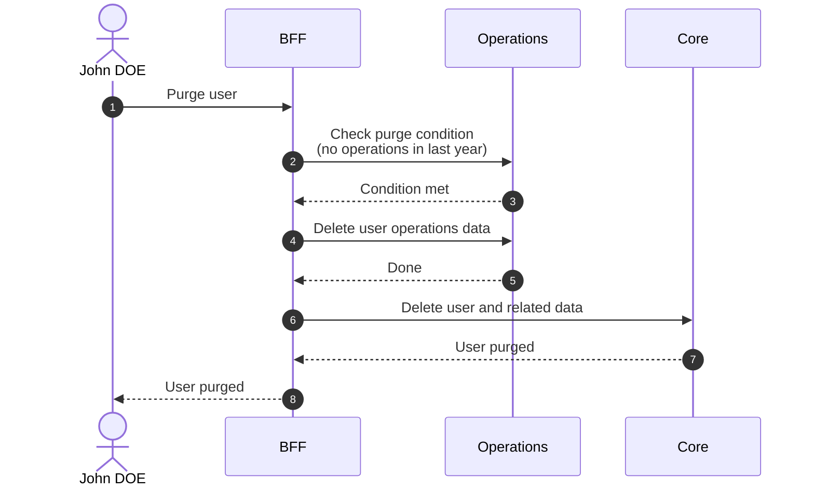

# Purge User

::: warning Irreversible
Purge is a permanent removal. It cannot be rolled back.
:::

## Objects used

- [User](/functional/business-objects/core/user)

## Allowed roles

- `SUPER_ADMIN`
- `ORGANIZATION_ADMIN`
- Any user for themselves

## Purge condition

The user must have had no related action in [operations](/functional/business-objects/operations) in the last year.

## Constraints

- The deletion MUST cascade to the [operations](/functional/business-objects/operations) module.
- The deletion cannot be rolled back

::: info Light user purge
For the purge of unlinked light users, see [Purge Light Users](/functional/features/purge-light-users).
:::

## Workflow

