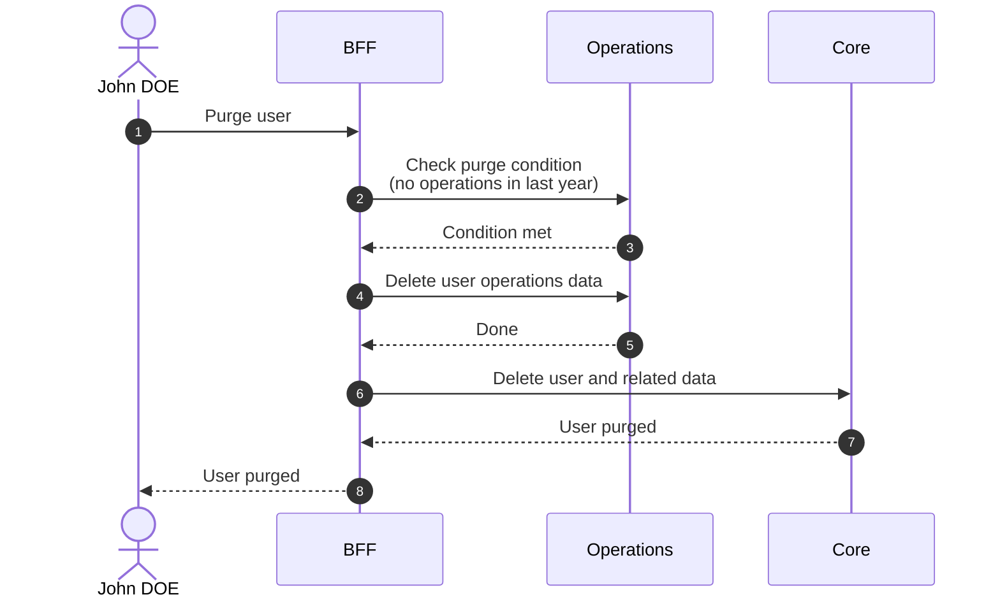
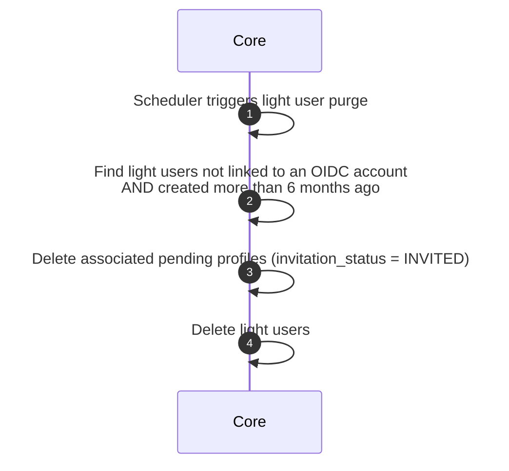

# Purge User

::: warning Irreversible
Purge is a permanent removal. It cannot be rolled back.
:::

## Objects used

- [User](/functional/business-objects/core/user)

## Allowed roles

- `SUPER_ADMIN`
- `ORGANIZATION_ADMIN`
- Any user for themselves

## Trigger

- Scheduler triggers purge of orphans for all projects on a regular basis (e.g., daily).
- Manual trigger by a user with the appropriate role through the BFF.

## Purge condition

The user must have had no related action in [operations](/functional/business-objects/operations/) in the last year.

## Constraints

- The deletion MUST cascade to the [operations](/functional/business-objects/operations/) module.
- The deletion cannot be rolled back

## Workflow

## Light user purge

A **light user** is a user record created in the database when an invitation is sent to an email address that has no existing OIDC account. No OIDC account is created — the record is a placeholder waiting to be claimed on first login.

See [Invite User to Project](/functional/features/invite-user-to-project) for the creation context.

### Allowed roles

- `SUPER_ADMIN`

## Trigger

- Scheduler triggers purge of orphans for all projects on a regular basis (e.g., daily).
- Manual trigger by a user with the appropriate role through the BFF.

### Purge condition

A light user is purged if they have not been linked to a real OIDC account within **6 months** of creation.

### Constraints

- Purge cascades to all pending invitations (`invitation_status = INVITED`) associated with the light user
- The deletion cannot be rolled back

### Workflow

