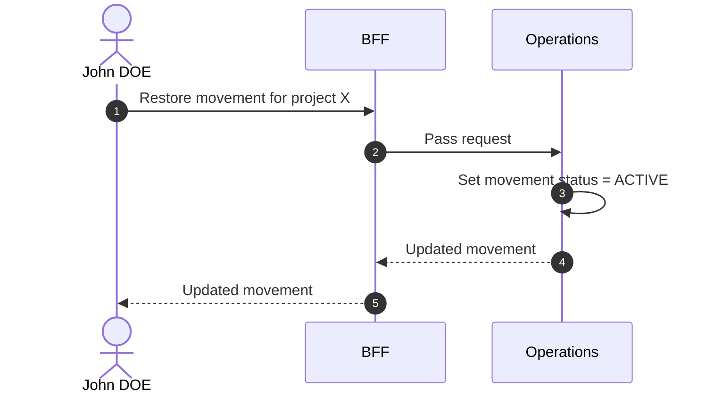

# Restore Movement

## Objects used

- [Movement](/functional/business-objects/operations/movement)

## Allowed roles

- `PROJECT_ADMIN`
- `PROJECT_MANAGER`

## Constraints

- Only applicable to `HIDDEN` movements

## Workflow

::: info
Access to the project scope is automatically gated by the [authentication profile check](/functional/features/authentication#project-scope-access-check).
:::

