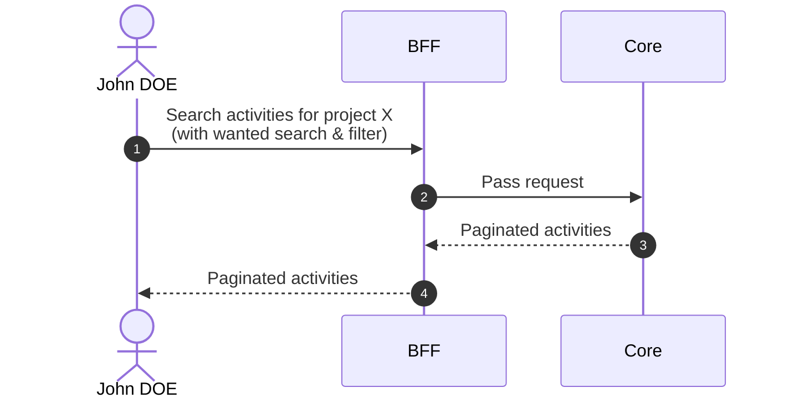
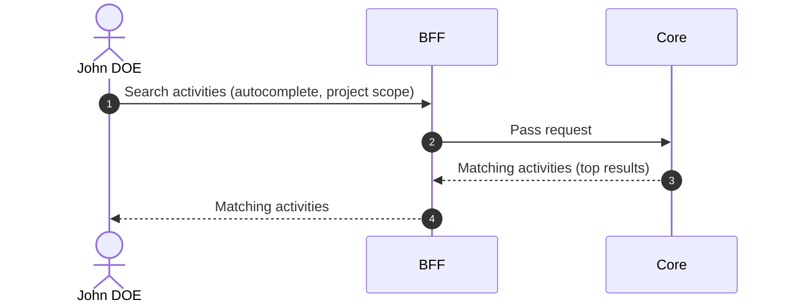

# Search Activities

::: info Option required
Requires the **ACTIVITY** option to be enabled on the project.
:::

## Objects used

- [Activity](/functional/business-objects/core/activity)

## Allowed roles

- `PROJECT_ADMIN`
- `PROJECT_MANAGER`
- `PROJECT_USER`

## Descriptions

### Pagination

The results of the search are paginated, refer to the [pagination](/functional/features/pagination) for more details.

### Search & Filters

#### Text search

| Property            | Value                                     |
|---------------------|-------------------------------------------|
| Type                | text                                      |
| Strictness          | non-strict                                |
| Required            | no                                        |
| Eligible for search | ``name`` (higher weight), ``description`` |

#### Capacity

| Property            | Value                              |
|---------------------|------------------------------------|
| Type                | number range                       |
| Strictness          | N/A                                |
| Required            | no                                 |
| Eligible for search | ``capacity_min``, ``capacity_max`` |

#### Duration

| Property            | Value        |
|---------------------|--------------|
| Type                | duration     |
| Strictness          | strict       |
| Required            | no           |
| Eligible for search | ``duration`` |

#### Availability dates

| Property            | Value                                        |
|---------------------|----------------------------------------------|
| Type                | date                                         |
| Strictness          | N/A                                          |
| Required            | no                                           |
| Eligible for search | ``availability_start``, ``availability_end`` |

#### Statuses

| Property            | Value           |
|---------------------|-----------------|
| Type                | array (of enum) |
| Strictness          | non-strict      |
| Required            | no              |
| Eligible for search | ``status``      |

## Workflow

::: info
Access to the project scope is automatically gated by the [authentication profile check](/functional/features/authentication#project-scope-access-check).
:::

## Autocomplete

Used in the [Create Movement](/functional/features/create-movement) flow to select an activity within the project scope. Text search only, no pagination.

### Allowed roles

- `PROJECT_ADMIN`
- `PROJECT_MANAGER`
- `PROJECT_USER`

### Workflow

