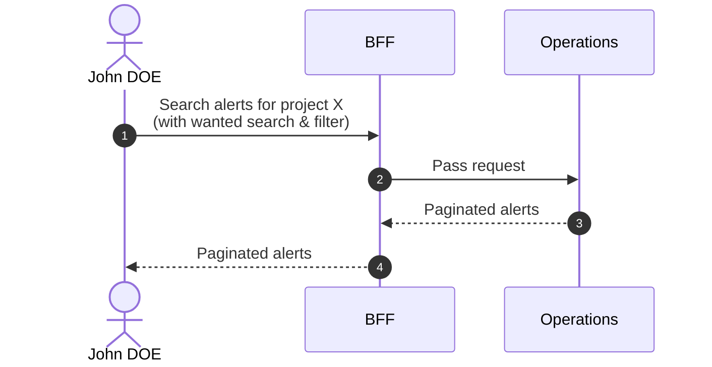
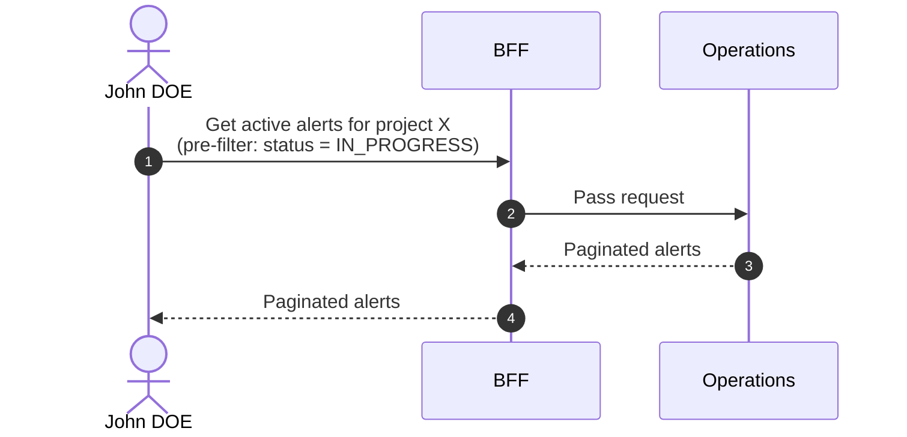

# Search Alerts

::: info Option required
Requires the **ALERT** option to be enabled on the project.
:::

## Objects used

- [Alert](/functional/business-objects/operations/alert)

## Allowed roles

- `PROJECT_ADMIN`
- `PROJECT_MANAGER`
- `PROJECT_USER`

::: info
Access to the project scope is automatically gated by the [authentication profile check](/functional/features/authentication#project-scope-access-check).
:::

## Search history page

Displays all alerts regardless of status. A status filter is available to narrow results.

### Pagination

The results of the search are paginated, refer to the [pagination](/functional/features/pagination) for more details.

### Search & Filters

#### Text search

| Property            | Value                  |
|---------------------|------------------------|
| Type                | text                   |
| Strictness          | non-strict             |
| Required            | no                     |
| Eligible for search | `title`, `description` |

#### Statuses

| Property            | Value           |
|---------------------|-----------------|
| Type                | array (of enum) |
| Strictness          | non-strict      |
| Required            | no              |
| Eligible for search | `status`        |

### Workflow

## Contextual component - Active alerts carousel

A carousel component that displays only alerts with `status` = `IN_PROGRESS`.
The status filter is pre-applied and not exposed to the user.

### Workflow

