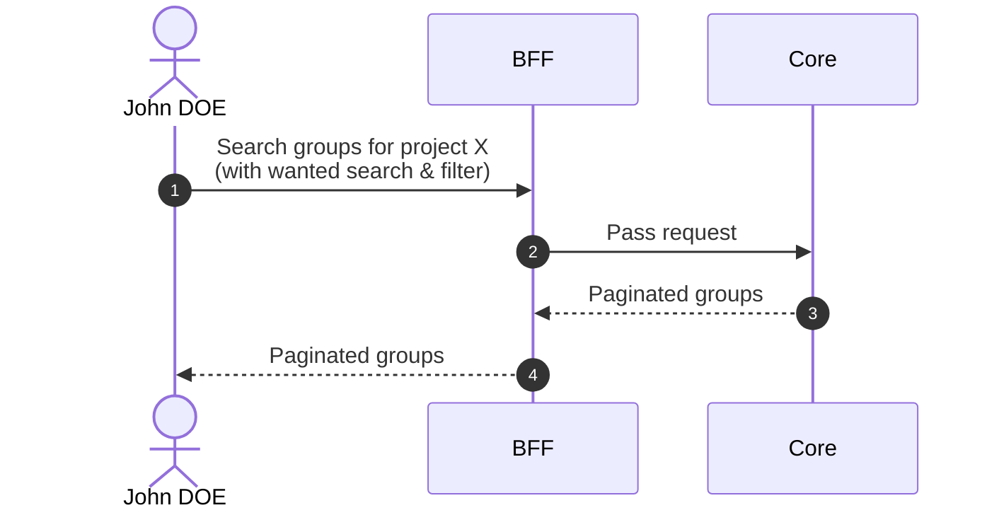
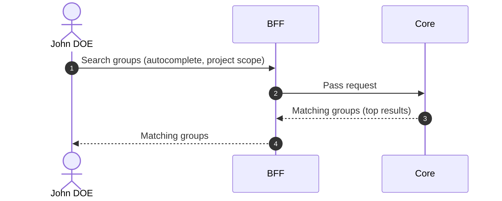

# Search Groups

::: info Option required
Requires the **GROUP** option to be enabled on the project.
:::

## Objects used

- [Group](/functional/business-objects/core/group)

## Allowed roles

- `PROJECT_ADMIN`
- `PROJECT_MANAGER`
- `PROJECT_USER`

## Descriptions

### Pagination

The results of the search are paginated, refer to the [pagination](/functional/features/pagination) for more details.

### Search & Filters

#### Text search

| Property            | Value      |
|---------------------|------------|
| Type                | text       |
| Strictness          | non-strict |
| Required            | no         |
| Eligible for search | ``name``   |

#### Attendance dates

| Property            | Value                                    |
|---------------------|------------------------------------------|
| Type                | date                                     |
| Strictness          | N/A                                      |
| Required            | no                                       |
| Eligible for search | ``attendance_start``, ``attendance_end`` |

#### Statuses

| Property            | Value           |
|---------------------|-----------------|
| Type                | array (of enum) |
| Strictness          | non-strict      |
| Required            | no              |
| Eligible for search | ``status``      |

## Workflow

::: info
Access to the project scope is automatically gated by the [authentication profile check](/functional/features/authentication#project-scope-access-check).
:::

## Autocomplete

Used in the [Create Movement](/functional/features/create-movement) flow to select a group within the project scope. Text search only, no pagination.

### Allowed roles

- `PROJECT_ADMIN`
- `PROJECT_MANAGER`
- `PROJECT_USER`

### Workflow

