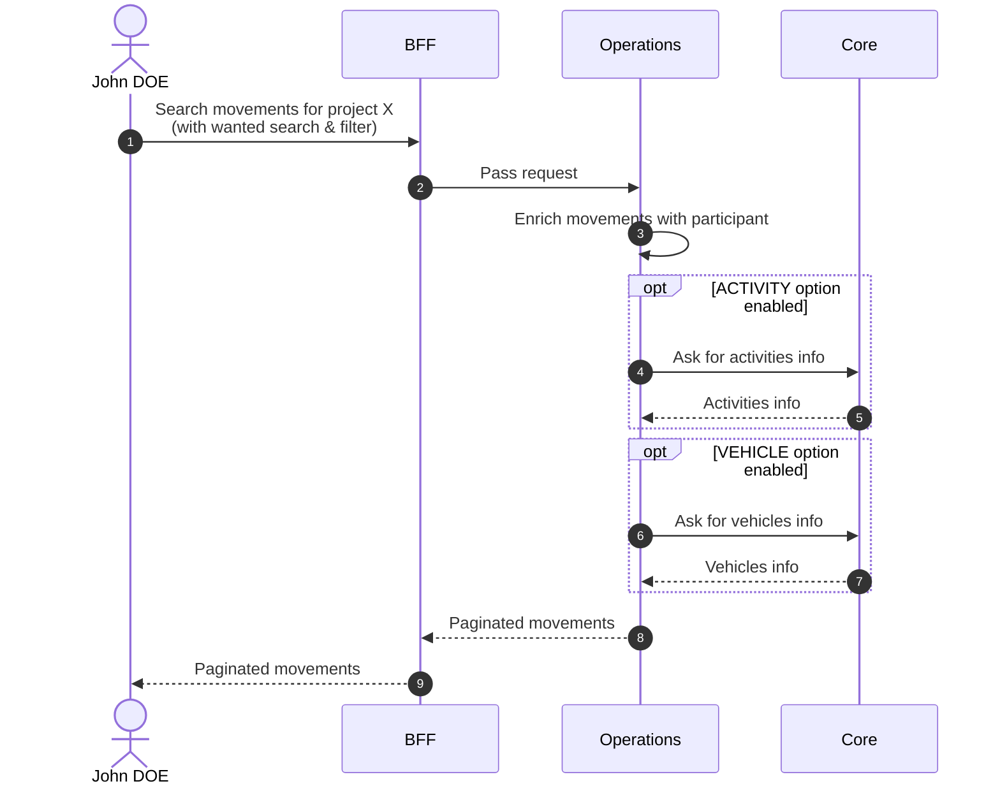
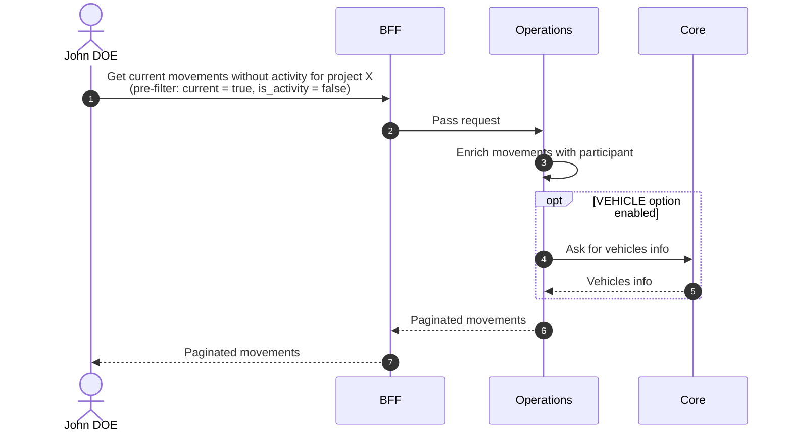
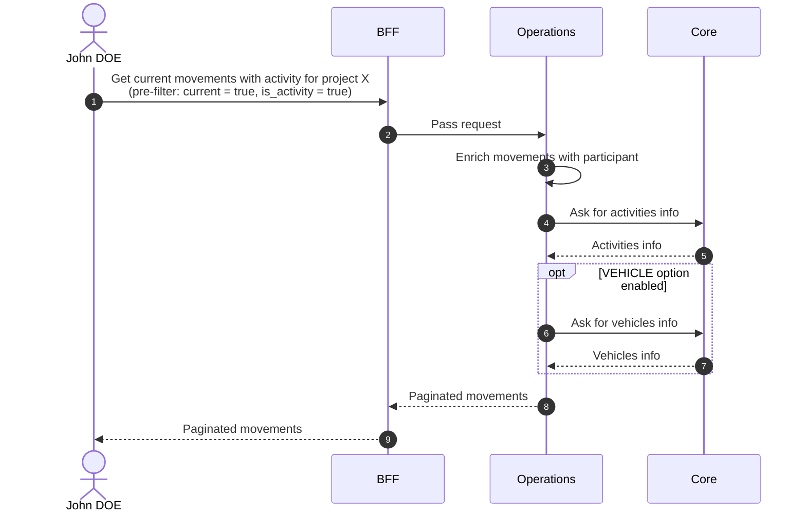

# Search Movements

## Objects used

- [Movement](/functional/business-objects/operations/movement)

## Allowed roles

- `PROJECT_ADMIN`
- `PROJECT_MANAGER`
- `PROJECT_USER`

::: info
Access to the project scope is automatically gated by the [authentication profile check](/functional/features/authentication#project-scope-access-check).
:::

## Search history page

Displays all movements regardless of status. A status filter is available to narrow results.

### Pagination

The results of the search are paginated, refer to the [pagination](/functional/features/pagination) for more details.

### Search & Filters

#### Timestamp range

| Property            | Value       |
|---------------------|-------------|
| Type                | date range  |
| Strictness          | N/A         |
| Required            | no          |
| Eligible for search | `timestamp` |

#### Directions

| Property            | Value           |
|---------------------|-----------------|
| Type                | array (of enum) |
| Strictness          | non-strict      |
| Required            | no              |
| Eligible for search | `direction`     |

#### Reasons

| Property            | Value           |
|---------------------|-----------------|
| Type                | array (of enum) |
| Strictness          | non-strict      |
| Required            | no              |
| Eligible for search | `reason`        |

#### Type

| Property            | Value            |
|---------------------|------------------|
| Type                | array (of enum)  |
| Strictness          | non-strict       |
| Required            | no               |
| Eligible for search | participant type |

::: info Type
Type is about `GUEST` or `REGISTERED` movement.
:::

#### Current

| Property            | Value                           |
|---------------------|---------------------------------|
| Type                | boolean                         |
| Strictness          | non-strict                      |
| Required            | no                              |
| Eligible for search | Not related to a specific field |

If `current` is true, the request returns non-natural movements that are not ended.

#### Is activity

| Property            | Value                   |
|---------------------|-------------------------|
| Type                | boolean                 |
| Strictness          | non-strict              |
| Required            | no                      |
| Eligible for search | `activity` (if defined) |

::: info Option required
Only available if the **ACTIVITY** option is enabled on the project.
:::

#### Is vehicle

| Property            | Value                  |
|---------------------|------------------------|
| Type                | boolean                |
| Strictness          | non-strict             |
| Required            | no                     |
| Eligible for search | `vehicle` (if defined) |

::: info Option required
Only available if the **VEHICLE** option is enabled on the project.
:::

#### Statuses

| Property            | Value           |
|---------------------|-----------------|
| Type                | array (of enum) |
| Strictness          | non-strict      |
| Required            | no              |
| Eligible for search | `status`        |

### Workflow

## Contextual component - Current movements without activity

Displays current movements that are not linked to an activity.

Pre-applied filter:

- `current` = `true`
- `is_activity` = `false` (when the ACTIVITY option is enabled)

### Workflow

## Contextual component - Current movements with activity

Displays current movements linked to an activity.

Pre-applied filter:

- `current` = `true`
- `is_activity` = `true`

::: info Option required
Only available if the **ACTIVITY** option is enabled on the project.
:::

### Workflow

