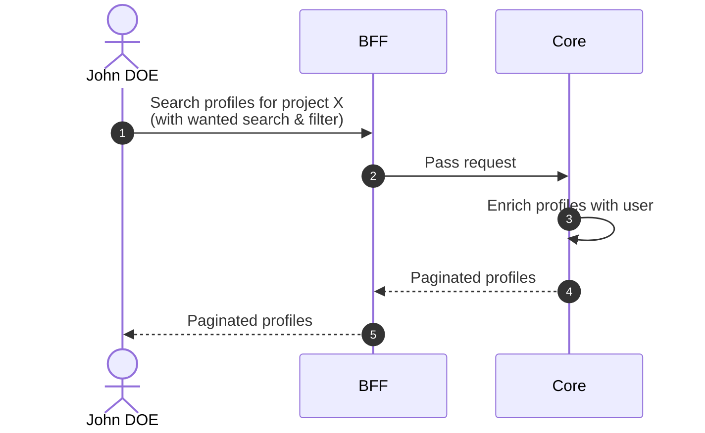
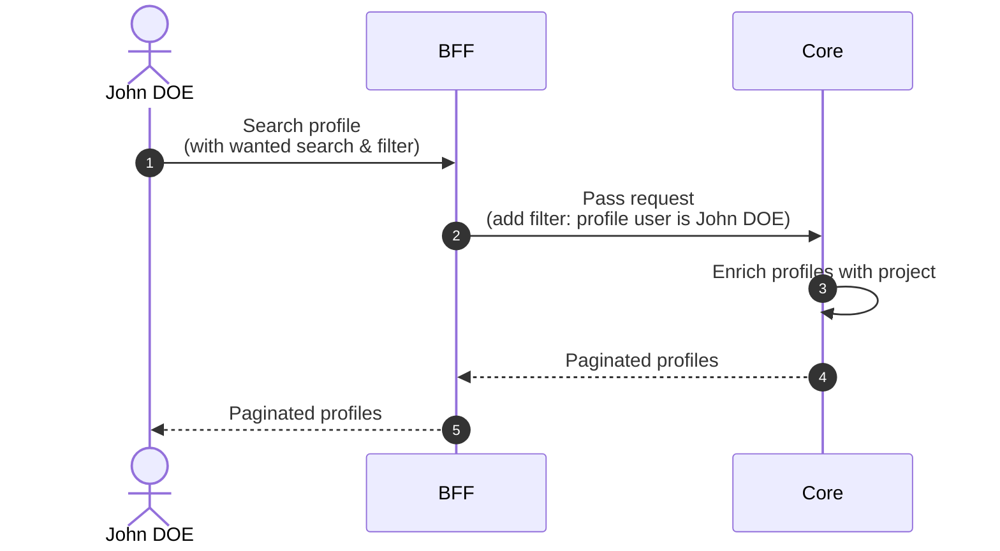

# Search Profiles

## Objects used

- [Profile](/functional/business-objects/core/profile)

## In project scope

### Allowed roles

- `PROJECT_ADMIN`

### Descriptions

#### Pagination

The results of the search are paginated, refer to the [pagination](/functional/features/pagination) for more details.

#### Search & Filters

##### Text search

| Property            | Value                                                 |
|---------------------|-------------------------------------------------------|
| Type                | text                                                  |
| Strictness          | non-strict                                            |
| Required            | no                                                    |
| Eligible for search | ``user.firstname``, ``user.lastname``, ``user.email`` |

##### Types

| Property            | Value           |
|---------------------|-----------------|
| Type                | array (of enum) |
| Strictness          | non-strict      |
| Required            | no              |
| Eligible for search | ``type``        |

##### Roles

| Property            | Value           |
|---------------------|-----------------|
| Type                | array (of enum) |
| Strictness          | non-strict      |
| Required            | no              |
| Eligible for search | ``role``        |

##### Access dates

| Property            | Value                            |
|---------------------|----------------------------------|
| Type                | date                             |
| Strictness          | N/A                              |
| Required            | no                               |
| Eligible for search | ``access_start``, ``access_end`` |

##### Invitation statuses

| Property            | Value                 |
|---------------------|-----------------------|
| Type                | array (of enum)       |
| Strictness          | non-strict            |
| Required            | no                    |
| Eligible for search | ``invitation_status`` |

##### Statuses

| Property            | Value           |
|---------------------|-----------------|
| Type                | array (of enum) |
| Strictness          | non-strict      |
| Required            | no              |
| Eligible for search | ``status``      |

### Workflow

::: info
Access to the project scope is automatically gated by the [authentication profile check](/functional/features/authentication#project-scope-access-check).
:::

## In user scope (own profiles)

### Allowed roles

- All users for their own profiles

### Invitations

Profiles with `invitation_status` = `INVITED`. The user sees their pending invitations to join projects.

#### Pagination

The results of the search are paginated, refer to the [pagination](/functional/features/pagination) for more details.

#### Search & Filters

##### Text search

| Property            | Value            |
|---------------------|------------------|
| Type                | text             |
| Strictness          | non-strict       |
| Required            | no               |
| Eligible for search | ``project.name`` |

### Active profiles

Profiles with `status` =
`ACTIVE`. Displayed as a list of projects the user is currently part of, with their associated role.

#### Pagination

The results of the search are paginated, refer to the [pagination](/functional/features/pagination) for more details.

#### Search & Filters

##### Text search

| Property            | Value            |
|---------------------|------------------|
| Type                | text             |
| Strictness          | non-strict       |
| Required            | no               |
| Eligible for search | ``project.name`` |

##### Roles

| Property            | Value           |
|---------------------|-----------------|
| Type                | array (of enum) |
| Strictness          | non-strict      |
| Required            | no              |
| Eligible for search | ``role``        |

##### Access dates

| Property            | Value                            |
|---------------------|----------------------------------|
| Type                | date                             |
| Strictness          | N/A                              |
| Required            | no                               |
| Eligible for search | ``access_start``, ``access_end`` |

### History

All profiles regardless of status (accepted and refused). Gives the user a full view of their participation history across projects.

#### Pagination

The results of the search are paginated, refer to the [pagination](/functional/features/pagination) for more details.

#### Search & Filters

##### Text search

| Property            | Value            |
|---------------------|------------------|
| Type                | text             |
| Strictness          | non-strict       |
| Required            | no               |
| Eligible for search | ``project.name`` |

##### Types

| Property            | Value           |
|---------------------|-----------------|
| Type                | array (of enum) |
| Strictness          | non-strict      |
| Required            | no              |
| Eligible for search | ``type``        |

::: info
Only `SUPER_ADMIN` sees this filter in the UI.
:::

##### Roles

| Property            | Value           |
|---------------------|-----------------|
| Type                | array (of enum) |
| Strictness          | non-strict      |
| Required            | no              |
| Eligible for search | ``role``        |

##### Access dates

| Property            | Value                            |
|---------------------|----------------------------------|
| Type                | date                             |
| Strictness          | N/A                              |
| Required            | no                               |
| Eligible for search | ``access_start``, ``access_end`` |

##### Invitation statuses

| Property            | Value                 |
|---------------------|-----------------------|
| Type                | array (of enum)       |
| Strictness          | non-strict            |
| Required            | no                    |
| Eligible for search | ``invitation_status`` |

##### Statuses

| Property            | Value           |
|---------------------|-----------------|
| Type                | array (of enum) |
| Strictness          | non-strict      |
| Required            | no              |
| Eligible for search | ``status``      |

### Workflow

