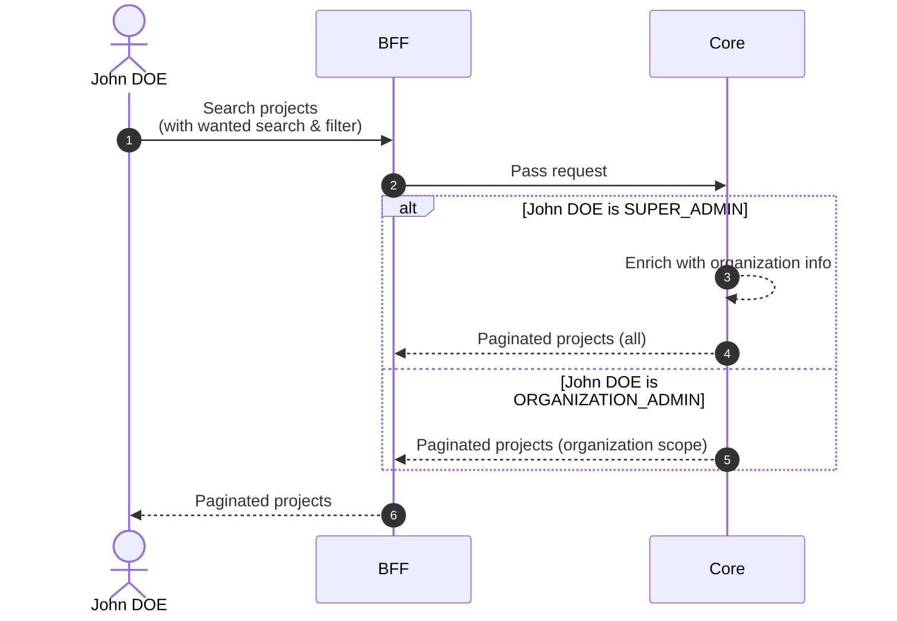

# Search Projects

## Objects used

- [Project](/functional/business-objects/core/project)

## Allowed roles

- `SUPER_ADMIN`
- `ORGANIZATION_ADMIN`

## Descriptions

### Pagination

The results of the search are paginated, refer to the [pagination](/functional/features/pagination) for more details.

### Search & Filters

#### Text search

| Property            | Value      |
|---------------------|------------|
| Type                | text       |
| Strictness          | non-strict |
| Required            | no         |
| Eligible for search | ``name``   |

#### Options

| Property            | Value           |
|---------------------|-----------------|
| Type                | array (of enum) |
| Strictness          | non-strict      |
| Required            | no              |
| Eligible for search | ``options``     |

#### Schedule dates

| Property            | Value                                |
|---------------------|--------------------------------------|
| Type                | date                                 |
| Strictness          | N/A                                  |
| Required            | no                                   |
| Eligible for search | ``schedule_start``, ``schedule_end`` |

#### Statuses

| Property            | Value           |
|---------------------|-----------------|
| Type                | array (of enum) |
| Strictness          | non-strict      |
| Required            | no              |
| Eligible for search | ``status``      |

## Workflow

::: info
`SUPER_ADMIN` searches across all projects.
`ORGANIZATION_ADMIN` is restricted to projects within their organization scope.
:::

