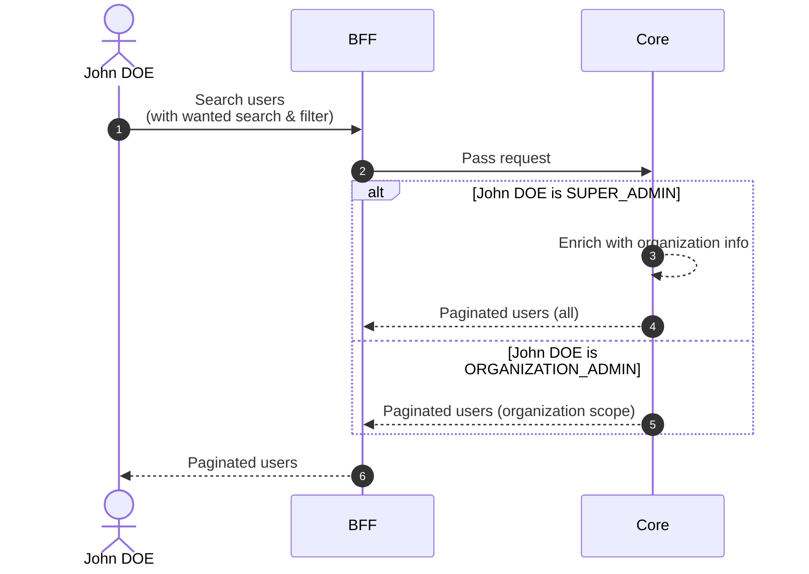
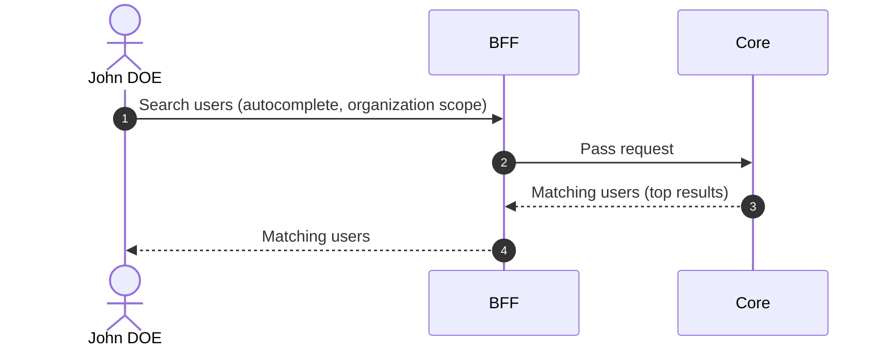

# Search Users

## Objects used

- [User](/functional/business-objects/core/user)

## Allowed roles

- `SUPER_ADMIN`
- `ORGANIZATION_ADMIN`

## Descriptions

### Pagination

The results of the search are paginated, refer to the [pagination](/functional/features/pagination) for more details.

### Search & Filters

#### Text search

| Property            | Value                                  |
|---------------------|----------------------------------------|
| Type                | text                                   |
| Strictness          | non-strict                             |
| Required            | no                                     |
| Eligible for search | ``firstname``, ``lastname``, ``email`` |

#### Statuses

| Property            | Value           |
|---------------------|-----------------|
| Type                | array (of enum) |
| Strictness          | non-strict      |
| Required            | no              |
| Eligible for search | ``status``      |

## Workflow

::: info
`SUPER_ADMIN` searches across all users. `ORGANIZATION_ADMIN` is restricted to users within their organization scope.
:::

## Autocomplete

Used in the [Invite User to Project](/functional/features/invite-user-to-project) flow to search for a user within the organization scope. Text search only, no pagination.

### Allowed roles

- `PROJECT_ADMIN` — scoped to their organization

### Workflow

