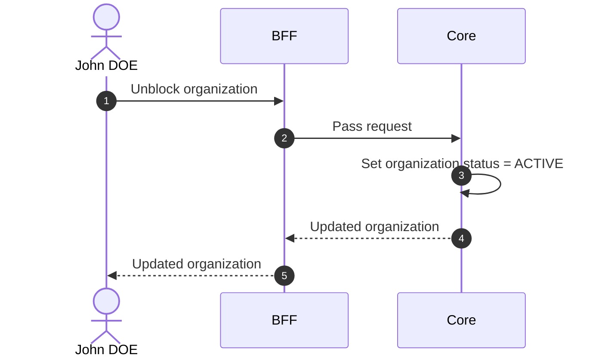

# Unblock Organization

## Objects used

- [Organization](/functional/business-objects/core/organization)

## Allowed roles

- `SUPER_ADMIN`

## Constraints

- Only applicable to `BLOCKED` organizations

::: warning Session impact
Access restoration is stateless and takes effect at each affected user's **next token refresh**, not immediately.
:::

## Workflow

