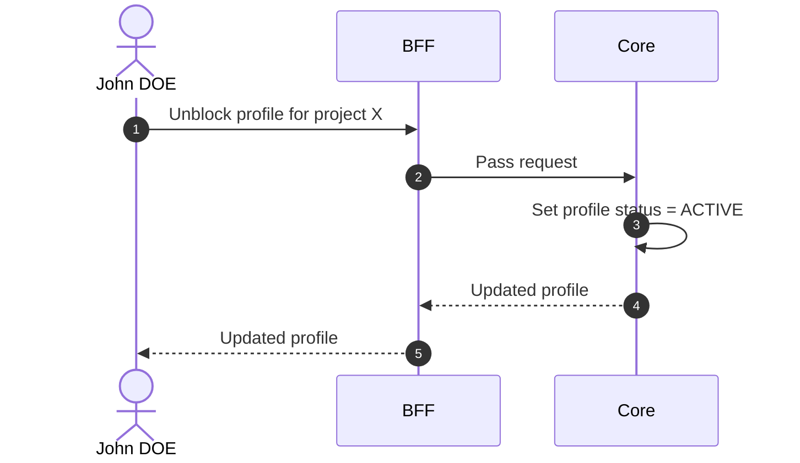

# Unblock Profile

## Objects used

- [Profile](/functional/business-objects/core/profile)

## Allowed roles

- `PROJECT_ADMIN`

## Constraints

- Only applicable to `BLOCKED` profiles

::: warning Session impact
Access restoration is stateless and takes effect at the affected user's **next token refresh**, not immediately.
:::

## Workflow

::: info
Access to the project scope is automatically gated by the [authentication profile check](/functional/features/authentication#project-scope-access-check).
:::

