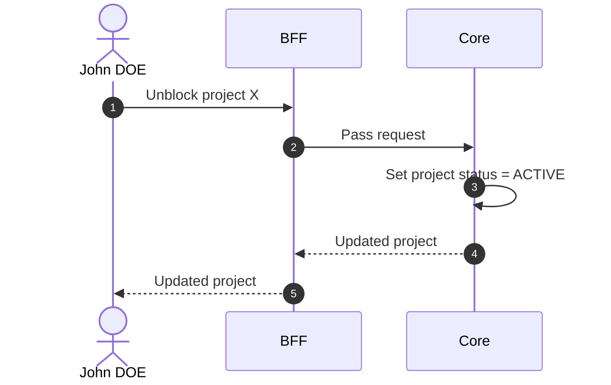

# Unblock Project

## Objects used

- [Project](/functional/business-objects/core/project)

## Allowed roles

- `SUPER_ADMIN`
- `ORGANIZATION_ADMIN`

## Constraints

- Only applicable to `BLOCKED` projects

::: warning Session impact
Access restoration is stateless and takes effect at each affected user's **next token refresh**, not immediately.
:::

## Workflow

