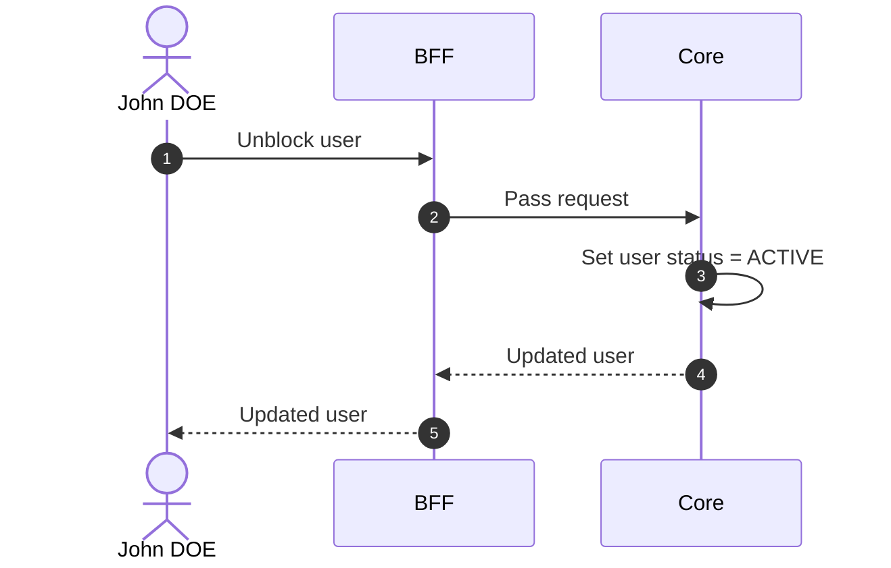

# Unblock User

## Objects used

- [User](/functional/business-objects/core/user)

## Allowed roles

- `SUPER_ADMIN`
- `ORGANIZATION_ADMIN`

## Constraints

- Only applicable to `BLOCKED` users

::: warning Session impact
Access restoration is stateless and takes effect at the affected user's **next token refresh**, not immediately.
:::

## Workflow

