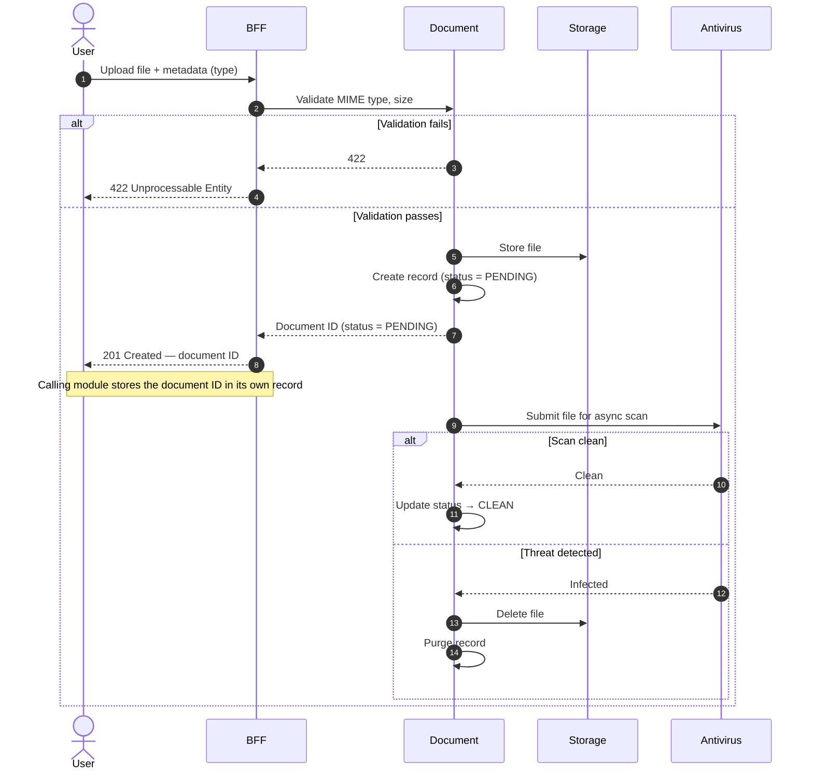

# Upload Document

## Objects used

- [Document](/functional/business-objects/document/)

## Allowed roles

Permissions depend on the document type. The document type configuration defines which roles are authorized to upload documents of that type. Refer to the document type configuration for the applicable role list.

## Constraints

- File must be one of the [allowed formats](/functional/business-objects/document/#allowed-formats): PDF, JPEG, PNG, TIFF
- File size must not exceed **5 MB**
- Document type is required and must belong to the organization's configured type list

::: info No ownership tracked by the document module
The upload request does not include an owning entity. The document module creates the document and returns its ID. The calling module is responsible for storing that ID in its own record.
:::

## Pre-upload validation

Validation is performed synchronously before the file is stored. If any rule fails, a
`422` is returned immediately and no record is created.

| Rule            | On failure                      |
|-----------------|---------------------------------|
| MIME type check | `422` returned, file not stored |
| Size limit      | `422` returned, file not stored |

## Antivirus scan

The antivirus scan runs **asynchronously** after the file is persisted. The document remains in
`PENDING` status until the scan completes.

| Scan result     | Outcome                                              |
|-----------------|------------------------------------------------------|
| No threat found | Status updated to `CLEAN`                            |
| Threat detected | File and record are **purged**; no persistent record |

::: warning Consuming module responsibility on purge
If the scan detects a threat, the document is deleted and the stored ID becomes a dead reference. The consuming module will receive a
`404` on the next download attempt and must handle it by transitioning its own business status accordingly (e.g.
`REJECTED`).
:::

## Workflow

