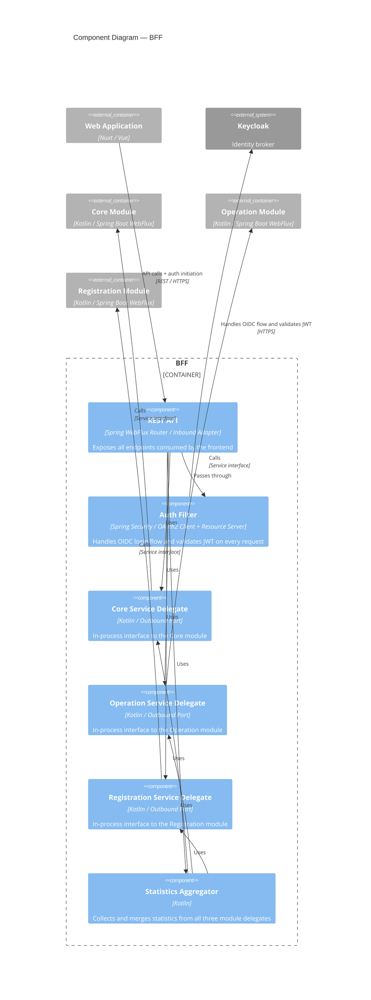

# Components – BFF

The BFF is the sole entry point for the frontend. It owns the full OIDC authentication flow, enforces authorisation, and
delegates domain operations to the backend modules through their inbound service interfaces.

## Components

| Component                     | Technology                                        | Role                                                                                                 |
|-------------------------------|---------------------------------------------------|------------------------------------------------------------------------------------------------------|
| REST API                      | Spring WebFlux Router                             | Inbound adapter — exposes all endpoints to the frontend                                              |
| Auth Filter                   | Spring Security / OAuth2 Client + Resource Server | Handles the full OIDC login flow; validates JWT on every subsequent request                          |
| Core Service Delegate         | Kotlin / Outbound Port                            | In-process interface to the Core module                                                              |
| Operation Service Delegate    | Kotlin / Outbound Port                            | In-process interface to the Operation module                                                         |
| Registration Service Delegate | Kotlin / Outbound Port                            | In-process interface to the Registration module                                                      |
| Statistics Aggregator         | Kotlin                                            | Collects and merges statistics from all three module delegates into a single project-scoped response |
