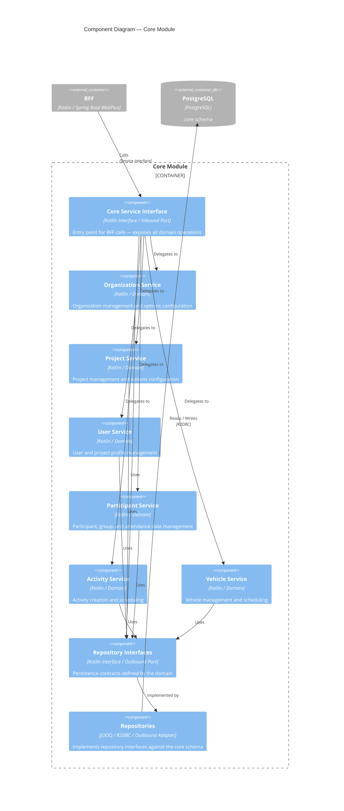

# Components – Core Module

The Core module manages the central domain entities: organizations, projects, users, participants, groups, activities,
and vehicles. It follows a hexagonal architecture — the BFF calls it through an inbound service interface, and
persistence is abstracted behind outbound repository interfaces.

## Components

| Component              | Technology       | Role                                                                          |
|------------------------|------------------|-------------------------------------------------------------------------------|
| Core Service Interface | Kotlin Interface | Inbound port — exposes all domain operations to the BFF                       |
| Organization Service   | Kotlin / Domain  | Organization management and options configuration                             |
| Project Service        | Kotlin / Domain  | Project management and options configuration                                  |
| User Service           | Kotlin / Domain  | User and project profile management                                           |
| Participant Service    | Kotlin / Domain  | Participant, group, and attendance date management                            |
| Activity Service       | Kotlin / Domain  | Activity creation and scheduling                                              |
| Vehicle Service        | Kotlin / Domain  | Vehicle management and scheduling                                             |
| Repository Interfaces  | Kotlin Interface | Outbound port — persistence contracts defined by the domain                   |
| Repositories           | jOOQ / R2DBC     | Outbound adapter — implements repository interfaces against the `core` schema |
