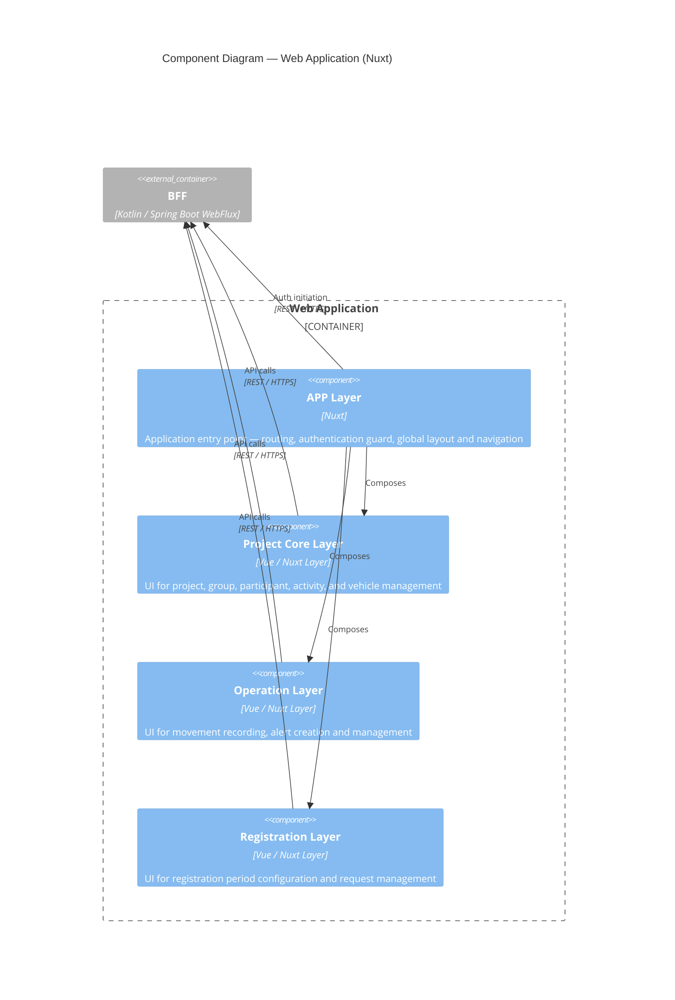

# Components – Web Application

The frontend is a **Nuxt application** structured using Nuxt Layers. Each layer encapsulates the UI concerns of one
domain module, mirroring the backend module structure. Authentication is handled entirely by the BFF — the frontend
never communicates directly with Keycloak.

## Components

| Component          | Technology       | Responsibility                                                 |
|--------------------|------------------|----------------------------------------------------------------|
| APP Layer          | Nuxt             | Entry point — routing, auth guard, shared layout, translations |
| Project Core Layer | Vue / Nuxt Layer | Project management, participants, groups, activities, vehicles |
| Operation Layer    | Vue / Nuxt Layer | Movements, alerts, communications                              |
| Registration Layer | Vue / Nuxt Layer | Registration periods and requests                              |
