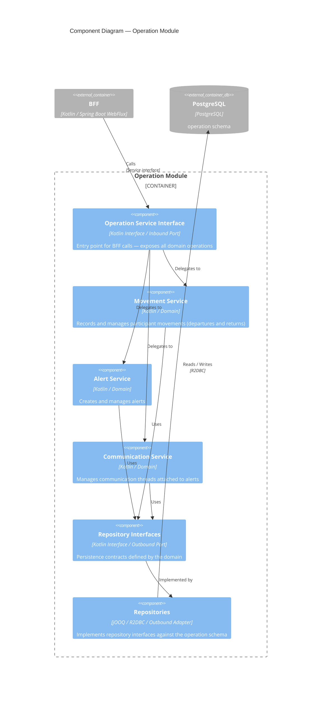

# Components – Operation Module

The Operation module manages movements, alerts, and communications. It follows a hexagonal architecture — the BFF calls it through an inbound service interface, and persistence is abstracted behind outbound repository interfaces.

## Components

| Component | Technology | Role |
|-----------|-----------|------|
| Operation Service Interface | Kotlin Interface | Inbound port — exposes all domain operations to the BFF |
| Movement Service | Kotlin / Domain | Records departures and returns for participants |
| Alert Service | Kotlin / Domain | Creates and manages alerts, independent of movement state |
| Communication Service | Kotlin / Domain | Manages communication threads attached to alerts |
| Repository Interfaces | Kotlin Interface | Outbound port — persistence contracts defined by the domain |
| Repositories | jOOQ / R2DBC | Outbound adapter — implements repository interfaces against the `operation` schema |
