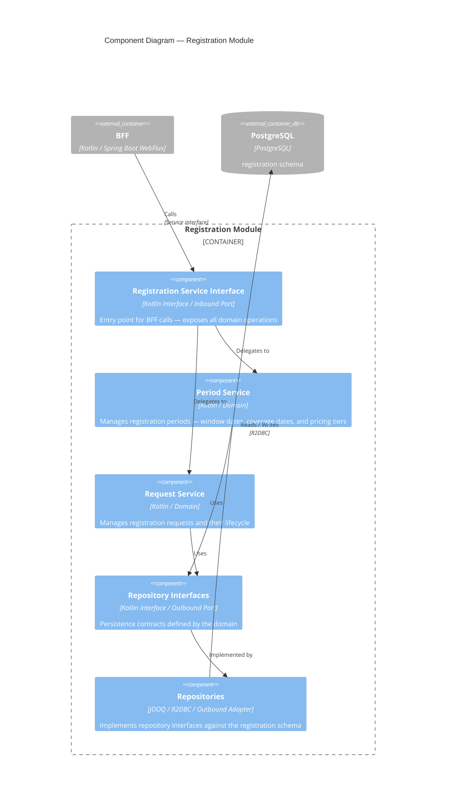

# Components – Registration Module

The Registration module manages registration periods and requests. It follows a hexagonal architecture — the BFF calls it through an inbound service interface, and persistence is abstracted behind outbound repository interfaces. It is available only when the REGISTRATION option is enabled on both the organisation and the project.

## Components

| Component | Technology | Role |
|-----------|-----------|------|
| Registration Service Interface | Kotlin Interface | Inbound port — exposes all domain operations to the BFF |
| Period Service | Kotlin / Domain | Registration period management — window dates, coverage dates, and pricing configuration |
| Request Service | Kotlin / Domain | Registration request lifecycle — from submission to confirmation or refusal |
| Repository Interfaces | Kotlin Interface | Outbound port — persistence contracts defined by the domain |
| Repositories | jOOQ / R2DBC | Outbound adapter — implements repository interfaces against the `registration` schema |
