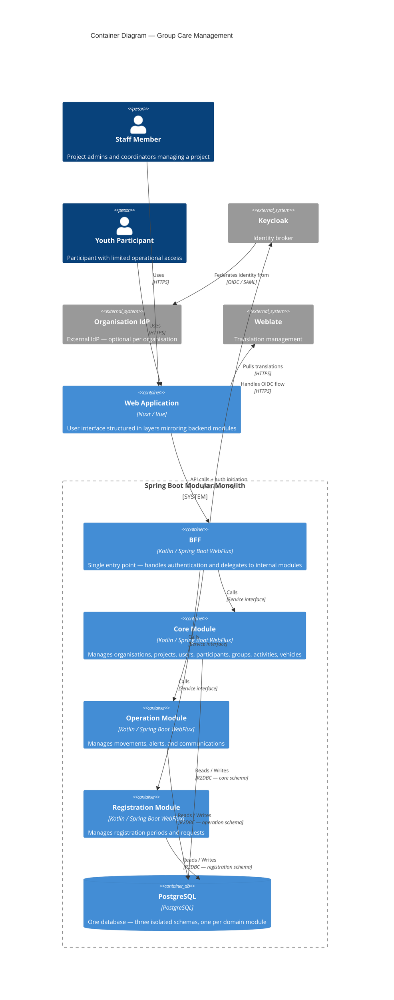

# Level 2 – Containers

This diagram shows the deployable units that make up the system and how they communicate.

## Containers

| Container           | Technology                   | Description                                                         |
|---------------------|------------------------------|---------------------------------------------------------------------|
| Web Application     | Nuxt / Vue                   | Frontend — structured in four layers (APP + one per backend module) |
| BFF                 | Kotlin / Spring Boot WebFlux | Backend For Frontend — the only container exposed to the frontend   |
| Core Module         | Kotlin / Spring Boot WebFlux | Domain core — organisations, projects, users, participants          |
| Operation Module    | Kotlin / Spring Boot WebFlux | Operations — movements, alerts, communications                      |
| Registration Module | Kotlin / Spring Boot WebFlux | Registrations — periods and requests                                |
| PostgreSQL          | PostgreSQL                   | Single database with three isolated schemas                         |

## Notes

- The Web Application is a separate Nuxt deployment. BFF, Core, Operation, and Registration are co-deployed as a single
  Spring Boot application (modular monolith).
- The BFF is the **only** container accessible from the frontend. Backend modules are internal.
- Each module owns exactly one database schema. No module queries another module's schema directly.
