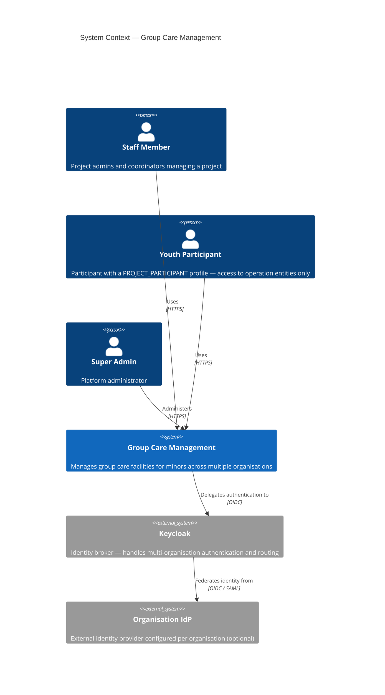

# Level 1 – System Context

This diagram shows the system as a whole, the people who interact with it, and the external systems it depends on.

## Elements

| Element               | Type            | Description                                                                                                                 |
|-----------------------|-----------------|-----------------------------------------------------------------------------------------------------------------------------|
| Staff Member          | Person          | Project admins and coordinators who manage projects, participants, movements, and registrations                             |
| Youth Participant     | Person          | A participant with a `PROJECT_PARTICIPANT` profile — can record movements, manage alerts, and participate in communications |
| Super Admin           | Person          | Platform administrator — manages users and can access any project via a temporary profile                                   |
| Group Care Management | System          | This application                                                                                                            |
| Keycloak              | External system | Identity broker — issues JWTs, routes users to the correct IdP based on their organisation slug                             |
| Organisation IdP      | External system | An optional external identity provider (e.g. Microsoft Entra, Google Workspace) configured per organisation                 |
