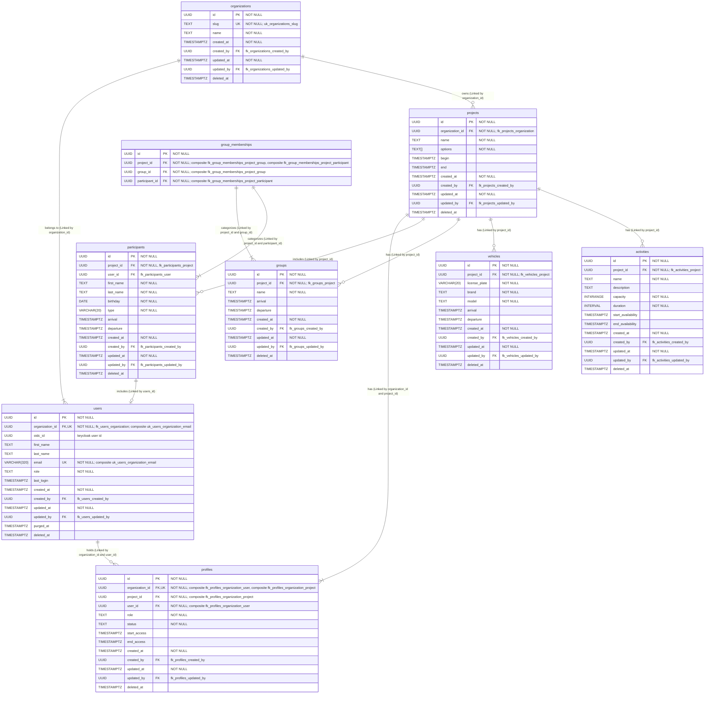
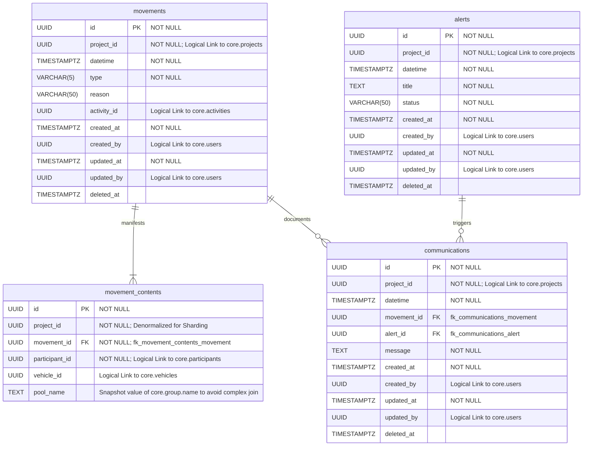
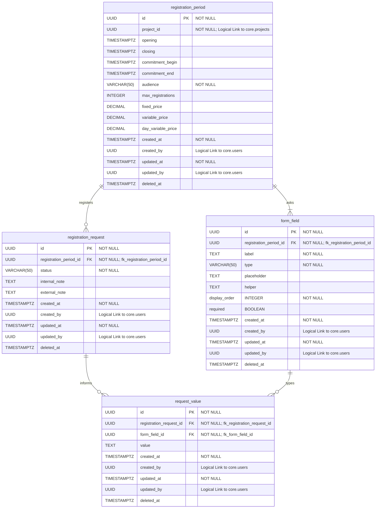

# Database

The application uses a single **PostgreSQL** instance with three isolated schemas — one per domain module. No module may
query another module's schema directly.

## Schema ownership

| Schema         | Owner               | Content                                                                                      |
|----------------|---------------------|----------------------------------------------------------------------------------------------|
| `core`         | Core Module         | Organizations, projects, users, project profiles, groups, participants, activities, vehicles |
| `operation`    | Operation Module    | Movements, alerts, communications                                                            |
| `registration` | Registration Module | Registration periods, registration requests                                                  |

## Isolation rules

- An application module's repositories access only their own schema.
- Cross-schema queries are forbidden — even via raw SQL.
- Cross-module data needs must go through the owning application module's service interface.

## Migrations

Each application module manages its own schema migrations independently using **Flyway
**. Migration scripts are versioned and
co-located with the module's source code.

| Module       | Migration location                             |
|--------------|------------------------------------------------|
| Core         | `core/src/main/resources/db/migration`         |
| Operation    | `operation/src/main/resources/db/migration`    |
| Registration | `registration/src/main/resources/db/migration` |

Flyway applies pending migrations automatically on startup. Each application module targets its own schema, so migration scripts
across modules are versioned independently.

## Access

All runtime database access uses **R2DBC** (reactive, non-blocking driver). Query construction uses **jOOQ** with the
R2DBC dialect. The only exception is **Flyway**, which uses JDBC exclusively for schema migrations at startup.

---

## Core schema

The `core` schema holds all domain entities shared across the application: organizations, users, projects, profiles,
participants, groups, vehicles, and activities.

### Entity-relationship diagram

### Table reference

#### `organizations`

Top-level tenant. Every user and project belongs to exactly one organization.

> → Functional reference: [Organization](/functional/business-objects/core/organization)

| Column       | Type          | Description                                              |
|--------------|---------------|----------------------------------------------------------|
| `id`         | `UUID`        | Primary key — generated by the application               |
| `slug`       | `TEXT`        | Unique business identifier used for auth routing         |
| `name`       | `TEXT`        | Display name                                             |
| `created_at` | `TIMESTAMPTZ` | Creation timestamp — managed by Spring Auditing          |
| `created_by` | `UUID`        | FK → `users.id` — user who created the record            |
| `updated_at` | `TIMESTAMPTZ` | Last modification timestamp — managed by Spring Auditing |
| `updated_by` | `UUID`        | FK → `users.id` — user who last modified the record      |
| `deleted_at` | `TIMESTAMPTZ` | Soft-delete timestamp — `NULL` means active              |

#### `users`

Application accounts. Each user belongs to one organization and holds a global role (`USER` or `SUPER_ADMIN`).

> → Functional reference: [User](/functional/business-objects/core/user)

| Column            | Type           | Description                                                                 |
|-------------------|----------------|-----------------------------------------------------------------------------|
| `id`              | `UUID`         | Primary key — generated by the application                                  |
| `organization_id` | `UUID`         | FK → `organizations.id` — owning organization; part of composite unique key |
| `oidc_id`         | `UUID`         | Keycloak user ID — links the record to the IdP identity                     |
| `first_name`      | `TEXT`         | First name *(nullable — not set until the user logs in for the first time)* |
| `last_name`       | `TEXT`         | Last name *(nullable)*                                                      |
| `email`           | `VARCHAR(320)` | Email address; composite unique key with `organization_id`                  |
| `role`            | `TEXT`         | Global role: `USER` or `SUPER_ADMIN`                                        |
| `last_login`      | `TIMESTAMPTZ`  | Timestamp of the most recent successful login                               |
| `created_at`      | `TIMESTAMPTZ`  | Creation timestamp                                                          |
| `created_by`      | `UUID`         | FK → `users.id`                                                             |
| `updated_at`      | `TIMESTAMPTZ`  | Last modification timestamp                                                 |
| `updated_by`      | `UUID`         | FK → `users.id`                                                             |
| `purged_at`       | `TIMESTAMPTZ`  | GDPR purge timestamp — personal data erased; shell kept for audit integrity |
| `deleted_at`      | `TIMESTAMPTZ`  | Soft-delete timestamp                                                       |

#### `projects`

Central domain object. Scopes all other entities. Stores enabled options as a `TEXT[]` array.

> → Functional reference: [Project](/functional/business-objects/core/project)

| Column            | Type          | Description                                                                   |
|-------------------|---------------|-------------------------------------------------------------------------------|
| `id`              | `UUID`        | Primary key                                                                   |
| `organization_id` | `UUID`        | FK → `organizations.id`                                                       |
| `name`            | `TEXT`        | Project name                                                                  |
| `options`         | `TEXT[]`      | Array of enabled option codes (e.g. `{VEHICLE,ACTIVITY,COMMUNICATION}`)       |
| `begin`           | `TIMESTAMPTZ` | Project start — stored as `TIMESTAMPTZ`, treated as date-only (00:00 applied) |
| `end`             | `TIMESTAMPTZ` | Project end — stored as `TIMESTAMPTZ`, treated as date-only (23:59 applied)   |
| `created_at`      | `TIMESTAMPTZ` | Creation timestamp                                                            |
| `created_by`      | `UUID`        | FK → `users.id`                                                               |
| `updated_at`      | `TIMESTAMPTZ` | Last modification timestamp                                                   |
| `updated_by`      | `UUID`        | FK → `users.id`                                                               |
| `deleted_at`      | `TIMESTAMPTZ` | Soft-delete timestamp                                                         |

#### `profiles`

Join table between a user and a project. Carries the project-level role, invitation status, and optional access dates.

> → Functional reference: [Roles](/functional/roles)

| Column            | Type          | Description                                                        |
|-------------------|---------------|--------------------------------------------------------------------|
| `id`              | `UUID`        | Primary key                                                        |
| `organization_id` | `UUID`        | Denormalised FK — part of composite FKs to both users and projects |
| `project_id`      | `UUID`        | FK → `projects.id`                                                 |
| `user_id`         | `UUID`        | FK → `users.id`                                                    |
| `role`            | `TEXT`        | `PROJECT_ADMIN`, `PROJECT_COORDINATOR`, or `PROJECT_PARTICIPANT`   |
| `status`          | `TEXT`        | `INVITED`, `ACCEPTED`, or `REJECTED`                               |
| `start_access`    | `TIMESTAMPTZ` | From when the profile is active *(NULL = immediately)*             |
| `end_access`      | `TIMESTAMPTZ` | Until when the profile is active *(NULL = permanent)*              |
| `created_at`      | `TIMESTAMPTZ` | Creation timestamp                                                 |
| `created_by`      | `UUID`        | FK → `users.id`                                                    |
| `updated_at`      | `TIMESTAMPTZ` | Last modification timestamp                                        |
| `updated_by`      | `UUID`        | FK → `users.id`                                                    |
| `deleted_at`      | `TIMESTAMPTZ` | Soft-delete timestamp                                              |

#### `participants`

A person registered in a project. Distinct from a user — can optionally be linked to a user account.

> → Functional reference: [Participant](/functional/business-objects/core/participant)

| Column       | Type          | Description                                                    |
|--------------|---------------|----------------------------------------------------------------|
| `id`         | `UUID`        | Primary key                                                    |
| `project_id` | `UUID`        | FK → `projects.id`                                             |
| `user_id`    | `UUID`        | FK → `users.id` — optional link to an application user         |
| `first_name` | `TEXT`        | First name                                                     |
| `last_name`  | `TEXT`        | Last name                                                      |
| `birthday`   | `DATE`        | Date of birth — used to determine minor/major status           |
| `type`       | `VARCHAR(20)` | Participant kind: `REGISTERED` or `GUEST`                      |
| `arrival`    | `TIMESTAMPTZ` | Personal arrival *(optional — falls back to group or project)* |
| `departure`  | `TIMESTAMPTZ` | Personal departure *(optional)*                                |
| `created_at` | `TIMESTAMPTZ` | Creation timestamp                                             |
| `created_by` | `UUID`        | FK → `users.id`                                                |
| `updated_at` | `TIMESTAMPTZ` | Last modification timestamp                                    |
| `updated_by` | `UUID`        | FK → `users.id`                                                |
| `deleted_at` | `TIMESTAMPTZ` | Soft-delete timestamp                                          |

#### `groups`

A named collection of participants within a project. Provides attendance date fallback for member participants.

> → Functional reference: [Group](/functional/business-objects/core/group)

| Column       | Type          | Description                                       |
|--------------|---------------|---------------------------------------------------|
| `id`         | `UUID`        | Primary key                                       |
| `project_id` | `UUID`        | FK → `projects.id`                                |
| `name`       | `TEXT`        | Group name                                        |
| `arrival`    | `TIMESTAMPTZ` | Group arrival *(optional — fallback for members)* |
| `departure`  | `TIMESTAMPTZ` | Group departure *(optional)*                      |
| `created_at` | `TIMESTAMPTZ` | Creation timestamp                                |
| `created_by` | `UUID`        | FK → `users.id`                                   |
| `updated_at` | `TIMESTAMPTZ` | Last modification timestamp                       |
| `updated_by` | `UUID`        | FK → `users.id`                                   |
| `deleted_at` | `TIMESTAMPTZ` | Soft-delete timestamp                             |

#### `group_memberships`

Pure join table — assigns a participant to a group within a project. Both FKs include `project_id` to enforce that the
group and the participant always belong to the same project.

| Column           | Type   | Description                                          |
|------------------|--------|------------------------------------------------------|
| `id`             | `UUID` | Primary key                                          |
| `project_id`     | `UUID` | Shared scope key — part of both composite FKs        |
| `group_id`       | `UUID` | FK → `groups.id` (composite with `project_id`)       |
| `participant_id` | `UUID` | FK → `participants.id` (composite with `project_id`) |

#### `vehicles`

A vehicle registered for use in movements. Requires the `VEHICLE` option to be enabled on the project.

> → Functional reference: [Vehicle](/functional/business-objects/core/vehicle)

| Column          | Type          | Description                     |
|-----------------|---------------|---------------------------------|
| `id`            | `UUID`        | Primary key                     |
| `project_id`    | `UUID`        | FK → `projects.id`              |
| `license_plate` | `VARCHAR(20)` | Vehicle registration number     |
| `brand`         | `TEXT`        | Manufacturer                    |
| `model`         | `TEXT`        | Model name                      |
| `arrival`       | `TIMESTAMPTZ` | Availability start *(optional)* |
| `departure`     | `TIMESTAMPTZ` | Availability end *(optional)*   |
| `created_at`    | `TIMESTAMPTZ` | Creation timestamp              |
| `created_by`    | `UUID`        | FK → `users.id`                 |
| `updated_at`    | `TIMESTAMPTZ` | Last modification timestamp     |
| `updated_by`    | `UUID`        | FK → `users.id`                 |
| `deleted_at`    | `TIMESTAMPTZ` | Soft-delete timestamp           |

#### `activities`

A named recurring event. Requires the `ACTIVITY` option. Capacity is stored as a PostgreSQL integer range (`INT4RANGE`)
to represent the min–max participant window. Duration is stored as a PostgreSQL `INTERVAL`.

> → Functional reference: [Activity](/functional/business-objects/core/activity)

| Column               | Type          | Description                                               |
|----------------------|---------------|-----------------------------------------------------------|
| `id`                 | `UUID`        | Primary key                                               |
| `project_id`         | `UUID`        | FK → `projects.id`                                        |
| `name`               | `TEXT`        | Activity name                                             |
| `description`        | `TEXT`        | Optional description                                      |
| `capacity`           | `INT4RANGE`   | Min–max participant range (e.g. `[5,15)` = min 5, max 14) |
| `duration`           | `INTERVAL`    | Expected duration of the activity                         |
| `start_availability` | `TIMESTAMPTZ` | From when the activity is available *(optional)*          |
| `end_availability`   | `TIMESTAMPTZ` | Until when the activity is available *(optional)*         |
| `created_at`         | `TIMESTAMPTZ` | Creation timestamp                                        |
| `created_by`         | `UUID`        | FK → `users.id`                                           |
| `updated_at`         | `TIMESTAMPTZ` | Last modification timestamp                               |
| `updated_by`         | `UUID`        | FK → `users.id`                                           |
| `deleted_at`         | `TIMESTAMPTZ` | Soft-delete timestamp                                     |

### Soft delete and audit pattern

All tables except `group_memberships` share the same audit and soft-delete convention:

- `created_at` / `updated_at` — managed by Spring Data Auditing (`@CreatedDate` / `@LastModifiedDate`)
- `created_by` / `updated_by` — FKs to `users.id`, populated from the authenticated session
- `deleted_at` — `NULL` while active; set to the current timestamp on soft delete

Records with a non-null `deleted_at` are excluded from all standard queries. Hard deletion is never performed except as
part of a GDPR purge (see [Data Policy](/functional/data-policy)).

---

## Operation schema

The `operation` schema holds all entities related to tracking movement of people at the project site and the management
of alerts and communications.

### Entity-relationship diagram

### Table reference

#### `movements`

A timestamped record of a single entry (`IN`) or exit (`OUT`) at the project site. Movements are mutable — they carry
full audit columns — but corrections in practice are done by soft-deleting and recreating rather than editing in place.

> → Functional reference: [Movement](/functional/business-objects/operations/movement)

| Column        | Type          | Description                                                                     |
|---------------|---------------|---------------------------------------------------------------------------------|
| `id`          | `UUID`        | Primary key                                                                     |
| `project_id`  | `UUID`        | Logical link → `core.projects.id`                                               |
| `datetime`    | `TIMESTAMPTZ` | Exact date and time of the movement                                             |
| `type`        | `VARCHAR(5)`  | Direction: `IN` or `OUT`                                                        |
| `reason`      | `VARCHAR(50)` | Reason code *(required for non-natural movements — see functional doc)*         |
| `activity_id` | `UUID`        | Logical link → `core.activities.id` — optional activity linked to this movement |
| `created_at`  | `TIMESTAMPTZ` | Creation timestamp                                                              |
| `created_by`  | `UUID`        | Logical link → `core.users.id`                                                  |
| `updated_at`  | `TIMESTAMPTZ` | Last modification timestamp                                                     |
| `updated_by`  | `UUID`        | Logical link → `core.users.id`                                                  |
| `deleted_at`  | `TIMESTAMPTZ` | Soft-delete timestamp                                                           |

#### `movement_contents`

One row per participant included in a movement. `project_id` is denormalised here to support future sharding without
requiring a join back to `movements`. `pool_name` is a snapshot of the group name at movement time, avoiding a
cross-schema join to `core.groups` at read time.

| Column           | Type   | Description                                                                              |
|------------------|--------|------------------------------------------------------------------------------------------|
| `id`             | `UUID` | Primary key                                                                              |
| `project_id`     | `UUID` | Denormalised — logical link → `core.projects.id`                                         |
| `movement_id`    | `UUID` | FK → `movements.id`                                                                      |
| `participant_id` | `UUID` | Logical link → `core.participants.id`                                                    |
| `vehicle_id`     | `UUID` | Logical link → `core.vehicles.id` — set when this participant is the driver *(optional)* |
| `pool_name`      | `TEXT` | Snapshot of `core.groups.name` at movement time — avoids cross-schema join *(optional)*  |

#### `alerts`

A structured alert with a mandatory status. Alerts are mutable and carry full audit timestamps.

> → Functional reference: [Alert](/functional/business-objects/operations/alert)

| Column       | Type          | Description                                             |
|--------------|---------------|---------------------------------------------------------|
| `id`         | `UUID`        | Primary key                                             |
| `project_id` | `UUID`        | Logical link → `core.projects.id`                       |
| `datetime`   | `TIMESTAMPTZ` | When the alert was created                              |
| `title`      | `TEXT`        | Short description of the alert topic                    |
| `status`     | `VARCHAR(50)` | Current state: `IN_PROGRESS`, `RESOLVED`, or `CANCELED` |
| `created_at` | `TIMESTAMPTZ` | Creation timestamp                                      |
| `created_by` | `UUID`        | Logical link → `core.users.id`                          |
| `updated_at` | `TIMESTAMPTZ` | Last modification timestamp                             |
| `updated_by` | `UUID`        | Logical link → `core.users.id`                          |
| `deleted_at` | `TIMESTAMPTZ` | Soft-delete timestamp                                   |

#### `communications`

A message in a communication thread. Each communication belongs to a project and is linked to either a movement or an
alert via an internal FK — never both, never neither. That exclusivity is enforced at the application level.

| Column        | Type          | Description                                                              |
|---------------|---------------|--------------------------------------------------------------------------|
| `id`          | `UUID`        | Primary key                                                              |
| `project_id`  | `UUID`        | Logical link → `core.projects.id`                                        |
| `datetime`    | `TIMESTAMPTZ` | When the message was sent                                                |
| `movement_id` | `UUID`        | FK → `movements.id` — set when this message belongs to a movement thread |
| `alert_id`    | `UUID`        | FK → `alerts.id` — set when this message belongs to an alert thread      |
| `message`     | `TEXT`        | Message body — required                                                  |
| `created_at`  | `TIMESTAMPTZ` | Creation timestamp                                                       |
| `created_by`  | `UUID`        | Logical link → `core.users.id`                                           |
| `updated_at`  | `TIMESTAMPTZ` | Last modification timestamp                                              |
| `updated_by`  | `UUID`        | Logical link → `core.users.id`                                           |
| `deleted_at`  | `TIMESTAMPTZ` | Soft-delete timestamp                                                    |

### Schema notes

**Cross-schema references are logical only.** `project_id`, `activity_id`, `participant_id`, `vehicle_id`, and
`created_by` / `updated_by` all reference entities in the `core` schema. Per the [isolation rules](#isolation-rules),
no database-level foreign key constraints cross schema boundaries — referential integrity at this boundary is enforced
by the application layer.

**`movement_contents.pool_name` is a snapshot.** It captures the group name at movement time rather than joining back
to `core.groups` at read time. This avoids a cross-schema join and ensures the historical record reflects what was true
when the movement was recorded, even if the group is later renamed or deleted.

**`movement_contents.project_id` is denormalised.** It duplicates the value already reachable via `movements`, but is
stored explicitly to support future sharding by project without requiring a join to the parent movement row.

**`communications` requires at least one thread FK.** A row must have at least one of `movement_id` or `alert_id`
set — a message with neither is invalid. Both can be set simultaneously. This constraint is enforced at the application level.

---

## Registration schema

The `registration` schema holds all entities related to the registration module: registration periods, their dynamic
form definitions, and the requests submitted by users.

### Entity-relationship diagram

### Table reference

#### `registration_period`

Defines when and how a project accepts registration requests. A project without a registration period does not appear
in the list of open projects and cannot receive requests.

> → Functional reference: [Registration Period](/functional/business-objects/registration/period)

Carries two independent sets of dates: the **registration window** (`opening` / `closing`) controls when users may
submit requests; the **project coverage** (`commitment_begin` / `commitment_end`) defines the portion of the project
a registrant is expected to attend.

| Column               | Type          | Description                                                                                         |
|----------------------|---------------|-----------------------------------------------------------------------------------------------------|
| `id`                 | `UUID`        | Primary key                                                                                         |
| `project_id`         | `UUID`        | Logical link → `core.projects.id`                                                                   |
| `opening`            | `TIMESTAMPTZ` | From when registrations are open *(open immediately if null)*                                       |
| `closing`            | `TIMESTAMPTZ` | Until when registrations are open *(open-ended if null)*                                            |
| `commitment_begin`   | `TIMESTAMPTZ` | Coverage start within the project *(defaults to project start date if null)*                        |
| `commitment_end`     | `TIMESTAMPTZ` | Coverage end within the project *(defaults to project end date if null)*                            |
| `audience`           | `VARCHAR(50)` | Who can register: `INDIVIDUAL`, `GROUP`, or `BOTH`                                                  |
| `max_registrations`  | `INTEGER`     | Maximum number of accepted registrations *(null = unlimited)*                                       |
| `fixed_price`        | `DECIMAL`     | Flat fee charged once per registration *(null = not applicable)*                                    |
| `variable_price`     | `DECIMAL`     | Per-person fee multiplied by participant count *(null = not applicable)*                            |
| `day_variable_price` | `DECIMAL`     | Per-person per-day fee multiplied by participant count × days of presence *(null = not applicable)* |
| `created_at`         | `TIMESTAMPTZ` | Creation timestamp                                                                                  |
| `created_by`         | `UUID`        | Logical link → `core.users.id`                                                                      |
| `updated_at`         | `TIMESTAMPTZ` | Last modification timestamp                                                                         |
| `updated_by`         | `UUID`        | Logical link → `core.users.id`                                                                      |
| `deleted_at`         | `TIMESTAMPTZ` | Soft-delete timestamp                                                                               |

#### `form_field`

A single field in the dynamic registration form attached to a period. Fields are presented to users in `display_order`
sequence when they fill in a request.

> → Functional reference: [Registration Form](/functional/business-objects/registration/field)

| Column                   | Type          | Description                                                                         |
|--------------------------|---------------|-------------------------------------------------------------------------------------|
| `id`                     | `UUID`        | Primary key                                                                         |
| `registration_period_id` | `UUID`        | FK → `registration_period.id`                                                       |
| `label`                  | `TEXT`        | Field label shown to the user                                                       |
| `type`                   | `VARCHAR(50)` | Input type (e.g. `TEXT`, `NUMBER`, `DATE`, `CHECKBOX`) — drives front-end rendering |
| `placeholder`            | `TEXT`        | Hint text displayed inside the input *(optional)*                                   |
| `helper`                 | `TEXT`        | Explanatory text shown below the field *(optional)*                                 |
| `display_order`          | `INTEGER`     | Sort position within the form — lower values appear first                           |
| `required`               | `BOOLEAN`     | Whether the field must be filled before the request can be submitted                |
| `created_at`             | `TIMESTAMPTZ` | Creation timestamp                                                                  |
| `created_by`             | `UUID`        | Logical link → `core.users.id`                                                      |
| `updated_at`             | `TIMESTAMPTZ` | Last modification timestamp                                                         |
| `updated_by`             | `UUID`        | Logical link → `core.users.id`                                                      |
| `deleted_at`             | `TIMESTAMPTZ` | Soft-delete timestamp                                                               |

#### `registration_request`

A request submitted by a user for a given registration period. Carries the current lifecycle status and optional notes
from both the admin (`internal_note`, not visible to the requester) and the requester (`external_note`).

> → Functional reference: [Registration Request](/functional/business-objects/registration/request)

| Column                   | Type          | Description                                                                                          |
|--------------------------|---------------|------------------------------------------------------------------------------------------------------|
| `id`                     | `UUID`        | Primary key                                                                                          |
| `registration_period_id` | `UUID`        | FK → `registration_period.id`                                                                        |
| `status`                 | `VARCHAR(50)` | Lifecycle state: `PENDING`, `NEED_SPECIFICATION`, `CONFIRMATION`, `ACCEPTED`, `REJECTED`, `CANCELED` |
| `internal_note`          | `TEXT`        | Admin-only note — never exposed to the requester *(optional)*                                        |
| `external_note`          | `TEXT`        | Note visible to the requester — used to communicate decisions or requests *(optional)*               |
| `created_at`             | `TIMESTAMPTZ` | Creation timestamp — also identifies the submitting user via `created_by`                            |
| `created_by`             | `UUID`        | Logical link → `core.users.id` — the user who submitted the request                                  |
| `updated_at`             | `TIMESTAMPTZ` | Last modification timestamp                                                                          |
| `updated_by`             | `UUID`        | Logical link → `core.users.id`                                                                       |
| `deleted_at`             | `TIMESTAMPTZ` | Soft-delete timestamp                                                                                |

#### `request_value`

One row per form field answer within a request. Together, all `request_value` rows for a request represent the user's
complete form submission. The `value` column is always stored as plain text regardless of the source field type — type
interpretation is handled at the application level.

| Column                    | Type          | Description                                                      |
|---------------------------|---------------|------------------------------------------------------------------|
| `id`                      | `UUID`        | Primary key                                                      |
| `registration_request_id` | `UUID`        | FK → `registration_request.id`                                   |
| `form_field_id`           | `UUID`        | FK → `form_field.id` — the field this value answers              |
| `value`                   | `TEXT`        | User-supplied answer serialised as text *(null if not answered)* |
| `created_at`              | `TIMESTAMPTZ` | Creation timestamp                                               |
| `created_by`              | `UUID`        | Logical link → `core.users.id`                                   |
| `updated_at`              | `TIMESTAMPTZ` | Last modification timestamp                                      |
| `updated_by`              | `UUID`        | Logical link → `core.users.id`                                   |
| `deleted_at`              | `TIMESTAMPTZ` | Soft-delete timestamp                                            |

### Schema notes

**Cross-schema references are logical only.** `project_id` and all `created_by` / `updated_by` columns reference
entities in the `core` schema. Per the [isolation rules](#isolation-rules), no database-level foreign key constraints
cross schema boundaries — referential integrity at this boundary is enforced by the application layer.

**`request_value.value` is always text.** The field type stored in `form_field.type` is a rendering and validation
hint for the front end and application layer. The database stores all answers as `TEXT`, leaving type coercion to the
consumer.

**`registration_request.created_by` identifies the requester.** There is no separate `requester_id` column — the
submitting user is captured by the standard `created_by` audit column, consistent with the audit pattern used across
all schemas.
