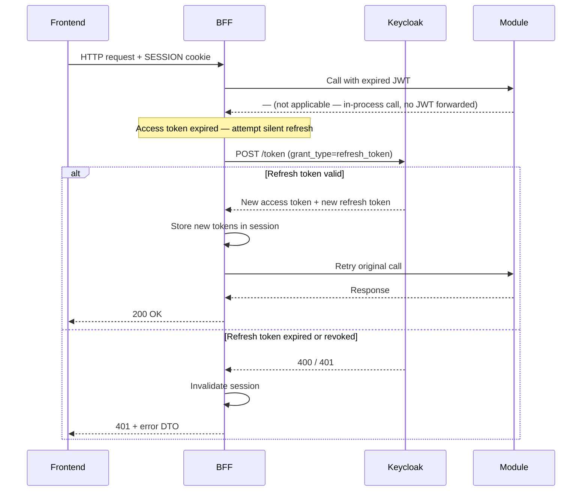

# Infrastructure Conventions

These conventions cover the operational configuration of the BFF and its connection to downstream dependencies.
They complement the [Spring & Kotlin Conventions](/technical/guidelines/spring) and
[Security Conventions](/technical/guidelines/security).

---

## CORS Configuration

**Convention: CORS is configured exclusively on the BFF. Backend modules do not expose CORS headers.**

The BFF is the sole HTTP entry point for the frontend. Backend modules are called in-process through inbound ports and
are never reachable from a browser — configuring CORS on them would be both redundant and misleading.

### Production configuration

```yaml
# BFF — application-prod.yml
spring:
  webflux:
    cors:
      allowed-origins: "https://app.yourdomain.com"   # never '*' in production
      allowed-methods: "GET,POST,PUT,DELETE,OPTIONS"
      allowed-headers: "Content-Type,X-Requested-With"
      expose-headers: "X-Total-Count"
      allow-credentials: true
      max-age: 3600
```

Rules:

- `allowed-origins` must list explicit origins — wildcard `*` is forbidden when `allow-credentials: true`
  (browsers reject this combination by spec)
- Do not include `Authorization` in `allowed-headers`: the frontend never sends a JWT — it sends only the session cookie
- `max-age` caches the preflight response for 1 hour — reduces OPTIONS noise without hiding real changes
- Configure per-environment: local dev uses `http://localhost:3000`, staging/prod use the deployment origin

### Development configuration

```yaml
# application-local.yml
spring:
  webflux:
    cors:
      allowed-origins: "http://localhost:3000"
      allow-credentials: true
```

### Spring WebFlux wiring

```kotlin
// ✅ correct — global CORS via CorsWebFilter, consistent with reactive pipeline
@Configuration
class CorsConfig {

    @Bean
    fun corsWebFilter(properties: WebFluxProperties): CorsWebFilter {
        val source = UrlBasedCorsConfigurationSource()
        val config = CorsConfiguration().apply {
            allowedOrigins = properties.cors.allowedOrigins
            allowedMethods = properties.cors.allowedMethods
            allowedHeaders = properties.cors.allowedHeaders
            exposedHeaders = properties.cors.exposeHeaders
            allowCredentials = properties.cors.allowCredentials
            maxAge = properties.cors.maxAge
        }
        source.registerCorsConfiguration("/api/**", config)
        return CorsWebFilter(source)
    }
}

// ❌ avoid — per-controller @CrossOrigin annotations, scattered and hard to audit
@CrossOrigin(origins = ["http://localhost:3000"])
@RestController
class ProjectController
```

### Forbidden patterns

| Pattern | Why | Alternative |
|---|---|---|
| `allowed-origins: "*"` in production | Exposes the API to any domain | Explicit origin list per environment |
| CORS config on backend modules | Modules are not HTTP-reachable from browsers | BFF only |
| `Authorization` in `allowed-headers` | Frontend never sends JWTs | Session cookie only |
| Per-controller `@CrossOrigin` | Duplicated, inconsistent, hard to audit | Central `CorsWebFilter` |

---

## Session Timeout and JWT Expiry at the BFF

**Convention: the BFF handles JWT expiry transparently via a silent token refresh. The frontend never interacts
with Keycloak directly and is never exposed to raw token errors.**

### Token lifetime strategy

The access token and the server-side session have independent lifetimes:

| Artefact | Typical lifetime | Where stored |
|---|---|---|
| Access token (JWT) | 5 minutes | BFF server-side session |
| Refresh token | 30 minutes (sliding) | BFF server-side session |
| Spring Session cookie | Configured independently | HttpOnly cookie in browser |

The Spring Session TTL should match or exceed the refresh token lifetime so that the server-side session is never
evicted while the refresh token is still valid.

### Silent refresh flow

When the downstream call to a module fails with 401 (expired access token), the BFF attempts a silent refresh before
surfacing the error to the frontend.



> **Note:** Because modules are called in-process (not over HTTP), they do not validate JWTs themselves. Token expiry
> is detected by the BFF when it needs to pass a valid token to an external system (e.g., a future outbound HTTP
> call). For strictly in-process calls, the access token check is a BFF-side proactive validation step.

### Proactive token validation

Rather than waiting for a downstream call to fail, the BFF validates the access token on every incoming request and
refreshes it proactively if it is within a configurable threshold of expiry.

```kotlin
// ✅ correct — proactive refresh before the token actually expires
@Component
class TokenRefreshFilter(
    private val authorizedClientService: ReactiveOAuth2AuthorizedClientService,
    private val authorizedClientManager: ReactiveOAuth2AuthorizedClientManager,
) : WebFilter {

    override fun filter(exchange: ServerWebExchange, chain: WebFilterChain): Mono<Void> =
        ReactiveSecurityContextHolder.getContext()
            .flatMap { ctx ->
                val auth = ctx.authentication as? OAuth2AuthenticationToken ?: return@flatMap chain.filter(exchange)
                authorizedClientService.loadAuthorizedClient<OAuth2AuthorizedClient>(
                    auth.authorizedClientRegistrationId,
                    auth.name,
                ).flatMap { client ->
                    if (client.accessToken.isExpiringSoon()) {
                        authorizedClientManager.authorize(
                            OAuth2AuthorizeRequest
                                .withAuthorizedClient(client)
                                .principal(auth)
                                .build()
                        ).then(chain.filter(exchange))
                    } else {
                        chain.filter(exchange)
                    }
                }
            }
            .switchIfEmpty(chain.filter(exchange))

    private fun OAuth2AccessToken.isExpiringSoon(): Boolean =
        expiresAt?.isBefore(Instant.now().plusSeconds(60)) ?: true
}
```

### Session expiry response

When a session cannot be recovered (refresh token expired or revoked), the BFF invalidates the session and returns
an `ErrorDto` with code `SESSION_EXPIRED` and HTTP 401. The `ErrorDto` shape and its i18n rules are defined in
[Error Response DTO](/technical/guidelines/coding-style#error-response-dto).

The frontend handles this response by redirecting the user to the login flow (see [Security](/technical/security)).

```kotlin
// ✅ correct — uses ErrorDto + MessageSource for i18n
@Component
class SessionExpiredEntryPoint(
    private val objectMapper: ObjectMapper,
    private val messageSource: MessageSource,
) : ServerAuthenticationEntryPoint {

    override fun commence(
        exchange: ServerWebExchange,
        ex: AuthenticationException,
    ): Mono<Void> {
        val locale = exchange.localeContext.locale ?: Locale.getDefault()
        val dto = ErrorDto(
            statusCode = HttpStatus.UNAUTHORIZED.value(),
            statusName = HttpStatus.UNAUTHORIZED.reasonPhrase,
            code = "SESSION_EXPIRED",
            title = messageSource.getMessage("error.SESSION_EXPIRED.title", null, locale),
            message = messageSource.getMessage("error.SESSION_EXPIRED.message", null, locale),
        )
        val response = exchange.response
        response.statusCode = HttpStatus.UNAUTHORIZED
        response.headers.contentType = MediaType.APPLICATION_JSON
        return response.writeWith(
            Mono.just(response.bufferFactory().wrap(objectMapper.writeValueAsBytes(dto)))
        )
    }
}
```

### Spring Session configuration

```yaml
# application.yml
spring:
  session:
    redis:
      flush-mode: on-save
      namespace: "bff:session"
    timeout: 30m   # must be >= refresh_token lifetime in Keycloak
  security:
    oauth2:
      client:
        provider:
          keycloak:
            token-uri: "https://keycloak.yourdomain.com/realms/{realm}/protocol/openid-connect/token"
        registration:
          keycloak:
            client-id: "${KEYCLOAK_CLIENT_ID}"
            client-secret: "${KEYCLOAK_CLIENT_SECRET}"
            authorization-grant-type: authorization_code
            scope: openid,profile,email,offline_access   # offline_access required for refresh tokens
```

> `offline_access` scope must be enabled in the Keycloak client configuration to receive a refresh token.

### Forbidden patterns

| Pattern | Why | Alternative |
|---|---|---|
| Returning the raw Keycloak 401 to the frontend | Leaks token infrastructure details | Map to standardised `SESSION_EXPIRED` DTO |
| Storing refresh token in the browser | Exposed to XSS | BFF server-side session only |
| Session TTL shorter than refresh token lifetime | Session evicted while refresh is still valid — user logged out prematurely | Align `spring.session.timeout` with Keycloak `refreshTokenLifespan` |
| Letting the frontend detect token expiry | Frontend must never hold or inspect a JWT | BFF handles transparently |

---

## R2DBC Connection Pool

**Convention: each module declares its own R2DBC connection pool with explicit sizing. Default pool settings
are not acceptable in production.**

The application runs three modules (Core, Operation, Registration), each with an independent `ConnectionFactory`.
Pool size must be planned against PostgreSQL's `max_connections` limit.

### Capacity planning

```
total_connections = Σ (pool_max_size per module × number of BFF instances)
total_connections ≤ postgres_max_connections × 0.8   (leave headroom for DBA and monitoring tools)
```

Example with 2 BFF instances, 3 modules, `max_connections = 100` on PostgreSQL:

```
pool_max_size = floor((100 × 0.8) / (3 modules × 2 instances)) = 13 per pool
```

Adjust `max_connections` on PostgreSQL or introduce PgBouncer (transaction mode) before scaling horizontally.

### Per-module pool configuration

```yaml
# application.yml — namespaced under modules.{name} (see Spring & Kotlin Conventions)
modules:
  core:
    r2dbc:
      url: "r2dbc:pool:postgresql://localhost:5432/mydb?currentSchema=core"
      pool:
        initial-size: 5
        max-size: 13
        max-idle-time: 30m
        max-life-time: 60m
        acquire-timeout: 5s
        acquire-retry: 3
        validation-query: "SELECT 1"
  operation:
    r2dbc:
      url: "r2dbc:pool:postgresql://localhost:5432/mydb?currentSchema=operation"
      pool:
        initial-size: 5
        max-size: 13
        max-idle-time: 30m
        max-life-time: 60m
        acquire-timeout: 5s
        acquire-retry: 3
        validation-query: "SELECT 1"
  registration:
    r2dbc:
      url: "r2dbc:pool:postgresql://localhost:5432/mydb?currentSchema=registration"
      pool:
        initial-size: 5
        max-size: 13
        max-idle-time: 30m
        max-life-time: 60m
        acquire-timeout: 5s
        acquire-retry: 3
        validation-query: "SELECT 1"
```

### Spring bean wiring

```kotlin
// ✅ correct — explicit pool wrapping the base ConnectionFactory
@Configuration
class CoreDatabaseConfig {

    @Bean("coreConnectionFactory")
    @DependsOn("coreFlyway")
    fun coreConnectionFactory(
        @Value("\${modules.core.r2dbc.url}") url: String,
        poolProperties: CoreR2dbcPoolProperties,
    ): ConnectionFactory {
        val base = ConnectionFactories.get(url)
        return ConnectionPool(
            ConnectionPoolConfiguration.builder(base)
                .initialSize(poolProperties.initialSize)
                .maxSize(poolProperties.maxSize)
                .maxIdleTime(poolProperties.maxIdleTime)
                .maxLifeTime(poolProperties.maxLifeTime)
                .acquireRetry(poolProperties.acquireRetry)
                .maxAcquireTime(poolProperties.acquireTimeout)
                .validationQuery(poolProperties.validationQuery)
                .build()
        )
    }
}

// ❌ avoid — raw ConnectionFactory without a pool (no connection reuse)
@Bean("coreConnectionFactory")
fun coreConnectionFactory(@Value("\${modules.core.r2dbc.url}") url: String) =
    ConnectionFactories.get(url)
```

### Key parameters

| Parameter | Recommended value | Rationale |
|---|---|---|
| `initial-size` | 5 | Pre-warm on startup — avoids cold latency on first requests |
| `max-size` | Calculated (see above) | Hard cap — prevents exhausting PostgreSQL `max_connections` |
| `max-idle-time` | 30m | Release idle connections before PostgreSQL's `tcp_keepalives_idle` kills them |
| `max-life-time` | 60m | Recycle long-lived connections proactively — avoids stale state |
| `acquire-timeout` | 5s | Fail fast rather than queue indefinitely — surfaces saturation early |
| `acquire-retry` | 3 | Tolerate transient pool saturation spikes |
| `validation-query` | `SELECT 1` | Evicts broken connections before they reach the application |

### Monitoring pool health

Expose pool metrics via Micrometer and alert on:

- `r2dbc.pool.acquired` consistently near `max-size` → pool saturation, scale or increase limit
- `r2dbc.pool.pending` > 0 for sustained periods → callers are waiting, investigate query latency first
- `r2dbc.pool.idle` near 0 → no idle slack, increase `max-size` or reduce query latency

```kotlin
// Actuator endpoint for pool metrics (add to management.endpoints.web.exposure.include)
// /actuator/metrics/r2dbc.pool.acquired?tag=name:coreConnectionFactory
```

### Forbidden patterns

| Pattern | Why | Alternative |
|---|---|---|
| Using `r2dbc:postgresql://` without `pool:` in the URL | Creates a raw connection per request — no reuse | `r2dbc:pool:postgresql://` with explicit `ConnectionPool` bean |
| Sharing a single `ConnectionFactory` across modules | Breaks module isolation, single point of failure | One pool per module, qualified with `@Qualifier` |
| Default pool size in production | R2DBC default is 10 — unplanned, risks exceeding `max_connections` | Explicit sizing per module based on capacity formula |
| `block()` while waiting for a connection | Blocks the event loop, causes deadlocks in reactive pipelines | Compose with `flatMap`, `zip`, or coroutine `await` |
