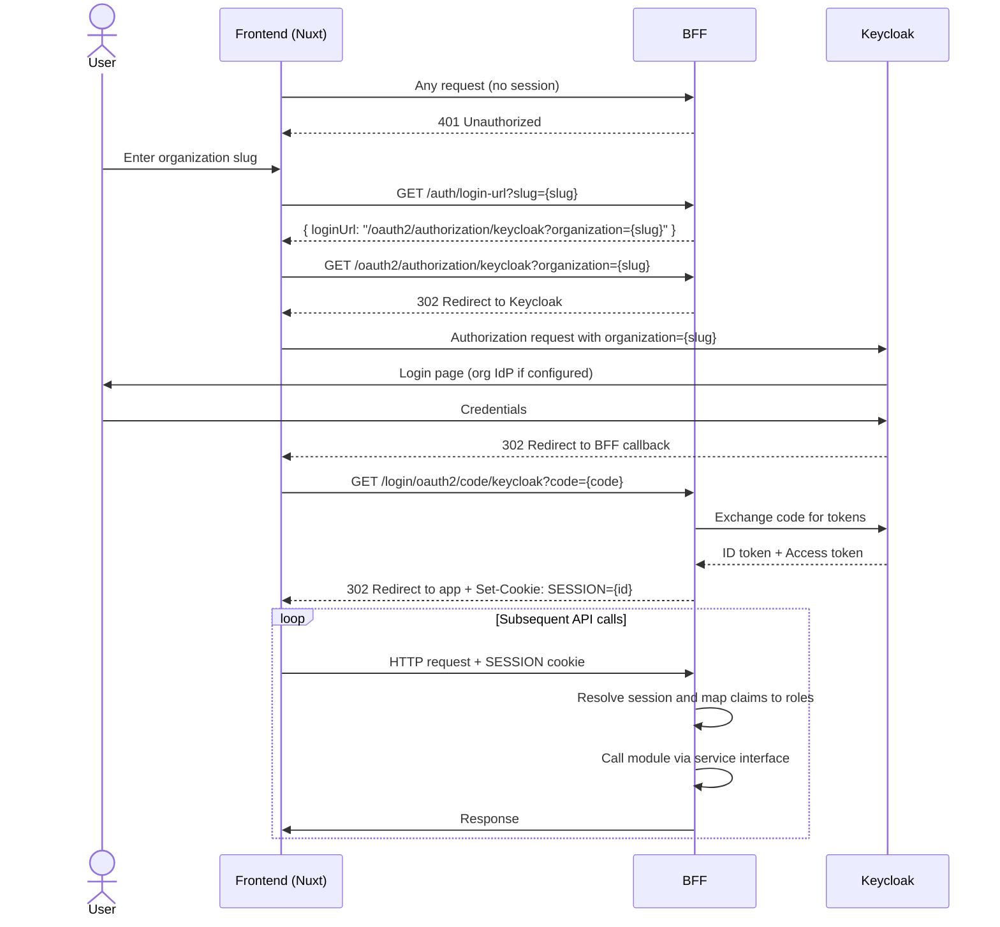

# Security

## Authentication

The application uses the **OAuth2 authorization code flow** via Keycloak 26.x. The BFF acts as the OAuth2 client (Spring
Security OAuth2 Client) and manages a **server-side web session**. The frontend never communicates directly with
Keycloak and never holds a JWT — it only carries a session cookie.

### Organization resolution

Each organization has a unique **business slug** used to route authentication to the correct Keycloak organization and
identity provider.

### Login flow

The `organization` parameter is picked up by a custom `OAuth2AuthorizationRequestResolver` in Spring Security, which
appends it to the Keycloak authorization request. The JWT is stored server-side in the web session — the frontend only
receives and forwards a session cookie.

### External IdP

Organizations that federate their identity through an external IdP (OIDC or SAML) can configure an identity provider in
Keycloak. Role claims in the IdP token are mapped to application roles via Keycloak identity provider mappers:

| IdP role claim value     | Application role       |
|--------------------------|------------------------|
| `MY_PROJECT_SUPER_ADMIN` | `SUPER_ADMIN` globally |

The organization is responsible for configuring and maintaining these role claims on their IdP. This is documented in
the onboarding process.

---

## Authorization

### Role model

Authorization uses a two-level role model:

| Level   | Role                  | Scope                                                                |
|---------|-----------------------|----------------------------------------------------------------------|
| Global  | `USER`                | Default role for all authenticated users                             |
| Global  | `SUPER_ADMIN`         | Full access across all organizations                                 |
| Project | `PROJECT_ADMIN`       | Full access to a specific project                                    |
| Project | `PROJECT_COORDINATOR` | Operational access — no admin settings, no profiles, no registration |
| Project | `PROJECT_PARTICIPANT` | Restricted access — operation entities only                          |

Project-level roles are held via **project profiles** stored in the `core` schema. A user has at most one profile per
project.

### Role enforcement

The BFF resolves the web session on every incoming request and maps the stored claims to application roles. All
authorisation decisions are made at the BFF level before any module service is called. Module services receive
already-authenticated, already-authorised calls through in-process service interfaces — they do not validate sessions or
tokens independently.

### Project profile creation

A project profile can be created in three ways:

1. **Manual assignment** — a `PROJECT_ADMIN` explicitly invites a user to the project with a role.
2. **Direct assignment** — `SUPER_ADMIN` only, creates a temporary one-hour `PROJECT_ADMIN` profile automatically
   accepted.
3. **Project creation** — When a user creates a project, they obtain a permanent `PROJECT_ADMIN` profile automatically for
   the project.
